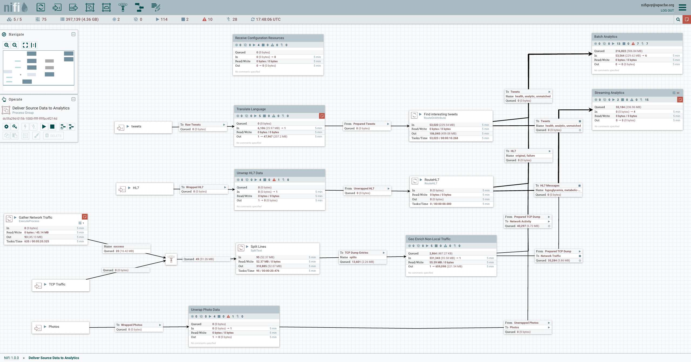

**Apache NiFi**

===

# Overview
## Flow

Source: Reference 6

## Architecture

Source: Reference 1

# Core Components
## FlowFile
Encapsulated data that is moved through and acted upon by the system.  Similar to HTTP responses in that FlowFiles have 2 components: Attributes (key-value meta data) and a pointer to the content (binary data).  The binary data is stored in the *Content Repository*, which implements a copy-on-write protocol (i.e. not write-in-place).

Source: Reference 5

### FlowFile Repository
A write-ahead log system that allows NiFi to recover from outages and connectivity issues.  It contains the *most current state* of the flow.

### Provenance Repository
A snapshop, *Provenance Event*, is saved whenever a FlowFile is modified.  The snapshot and its context is stored in the *Provenance Repository*, which can be utilitized to determine flow file lineage.

## Processors
Processors are responsible for creating, sending, receiving, transforming, routing, splitting, merging, and processing FlowFiles. They are THE building block for dataflows.  Individual processors can be composed to form a *Process Group*.

#### Built in Processors
As of the writing, V 1.11.3, There are roughly 280 built in processors.  Some examples:

> ConvertJSONToSQL, EncryptContent, ExecuteScript, ExecuteSQL, FetchFTP, FetchHDFS, FetchParquet, FetchS3Object, GetHTTP, MergeContent, ReplaceText, SplitRecord, SplitText

[List of Processors available in V 1.11.3](https://www.nifi.rocks/apache-nifi-processors/)

#### Custom Scripts
The ExecuteScript and InvokeScriptedProcessor processors allow you to execute scripts that are written in most common programming languages, including Python and Clojure.

#### Custom Processors
Pipeline authors are also able to create their own processors, giving users a configurable standard unit with which to build a flow.

[Short post on writing your own processor](https://community.cloudera.com/t5/Community-Articles/Build-Custom-Nifi-Processor/ta-p/244734)

## Connection
Processors are stitched together with *connections*, which act as queues providing support for back pressure and pressure release.  The connections allow for asynchronous processing and differences in processor run time.  Connections can also function as prioritized queues, allowing for a standard processin order (e.g. FIFO or LIFO) or priority based on a flow file attribute.

## Flow Controller
### Controller Service
A daemon process that facilitates the management of shared resources like database connections or cloud services provider credentials. They live at the Controller level and provide configuration, resources, and parameters for processors to execute so that individual processors do not need to be configured with all credentials and connections.

---
# Key Features
- **Developer API** to command and control a NiFi instance in real time. Start and stop processors, monitor queues, query provenance data, and more.
- **Scaling** is achieved horizontally via the addition of new nodes to the NiFi cluster and vertically via the provisioning of more resources (i.e. threads) to individual processors.
- **Record-level processors** for more granular control (assumes a record-oriented file, such as CSV or JSON)
- **Templates** can be created from entire flows and imported from and exported to XML
  - Caveat - credentials are not stored in the template and must be handled separately. 

---
## Analysis

#### Pros
- Opensource
  - Free
  - Power to customize and white label
- Versioning of flows
  - https://nifi.apache.org/registry.html
- Data Provenance
- Support for push and pull models of ingestion

#### Cons
- Built more for data engineers building pipelines rather than for non-technical consumers.
- UI is rather ugly
- I don't know how I feel about nodes running in a JVM instance

# Crash course notes
- Recommend beefy nodes with at most a dozen nodes in a cluster
  - Limit heartbeat communication overhead (network and processor) of primary node
- *Reader and *Writer controller services allow record level manipulation
  - You use to have to split a 50 line (record) csv file into 50 flow files and then operate on each ...
- For a cluster, a flow is running across all nodes and the primary node is responsible for dividing work across all nodes
- Explicitly says that NiFi should not be used to run scikit learn / ML processes (e.g. python scripts) and that it expects to call out to some external service for that

## Quickstart guide:
Use docker to get nifi running locally, without authentication enabled:

`$ docker run --name nifi -p 8080:8080 -d apache/nifi:latest`

Bring up your favorite web browser and navigate to: [localhost:8080/nifi](localhost:8080/nifi)

# References
## Additional Resources
1. [Apache Documentation](https://nifi.apache.org/docs/nifi-docs/components/nifi-docs/)
2. [Apache NiFi Crash Course](https://www.youtube.com/watch?v=fblkgr1PJ0o)
3. [Best practices from running NiFi at Renault](https://www.youtube.com/watch?v=rF7FV8cCYIc)
4. [Basic Udemy Course](https://www.udemy.com/course/apache-nifi/)
5. [Docker hub page](https://hub.docker.com/r/apache/nifi/)
6. [Good Blog intro to concepts](https://www.freecodecamp.org/news/nifi-surf-on-your-dataflow-4f3343c50aa2/)
7. [Example Flow with Clojure processor](http://blog.hellonico.info/devops/nifi/)

## Alternatives
- [Open Source alternatives](https://solutionsreview.com/data-integration/top-free-and-open-source-etl-tools-for-data-integration/)
- [Buyers Guide for Data Integration tools ... maybe useful](https://solutionsreview.com/data-integration/data-integration-buyers-guide/)
- [More data integration tools](https://www.alooma.com/blog/data-integration-tools)
- [Pipeline technologies list](https://github.com/pditommaso/awesome-pipeline)
- [Apache StreamPipes](https://projects.apache.org/project.html?incubator-streampipes)
