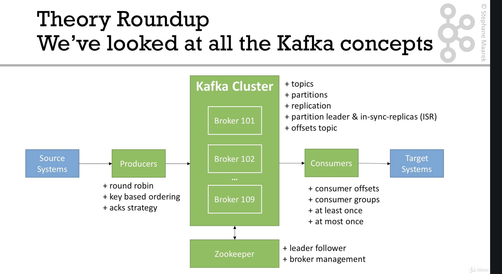

**Kafka**

===

Kafka is a high-throughput distributed messaging system that commonly serves the following use cases for huge firms:

- Messaging system
- Activity tracking
- Metrics gathering
- Application log gathering
- Stream processing
- System de-coupling
- Integration between Big Data technologies like Spark, Flint, Storm, and Hadoop

In all of these scenarios, Kafka is used as a transportation mechanism.

# Architecture

The key data structure in Kafka is a *topic*, which is a stream of data.  A *topic* is split into *partitions*, the number of which is specified at the point of topic creation. Within each partition, distinct datums are identified by their offset (incremental, starting at 0).

- Order is guaranteed within a partition (offset 3 < offset 5)
- Data can be persisted for various lengths (topic level setting)
- Data is immutable
- Data is assigned to a random partition

Zookeeper is used to facilitate the various processes and metadata involved in running the cluster.

## Components
### Brokers
A kafka cluster is composed of multiple servers, called *brokers*.  Each broker contains a subset of the cluster's *topic* *partitions*, where the *partitions* are replicated and distributed so that data can (most likely) be accessed if any particular *broker* becomes unavailable.

Each *partition* is treated as a mini-cluster in that one *broker* will serve as the primary node (*leader*) for the *partition* and ensure that that *partition* is replicated (and that those replications are synchronized) across other *brokers*.  Zookeeper is used to handle the leader election process.

Every broker is a *bootstrap server*, which implies that it knows about the cluster architecture (i.e. all brokers, topics, and partitions).  By storing this information, a consumer or producer need only connect to a single broker in order to discover/access the entire cluster.

### Producers
Producers write data to a topic, using a round-robin algorithm (default) for partition selection.  Note that this yields the benefits of load-balancing.  Optionally, the producer can attach a *key* to a message.  Assuming that no new partitions are added to a topic between meesage writes, all messages with a given key are sent to the same partition (using hashing), which allows those messages to be ordered (by offset).  This allows for sequentially storing time-series data for an entity.

Producers can wait for write acknowledgement or fire and forget.

### Consumers
Consumers read data from a topic's partitions, where there is no ordering between partitions but where data from a single partition is read in order (according to the partition offset).  To enable fault-tolerance, consumers records the offset of the processed data in one of three ways:

- At most once : offsets are committed when the message is received
- At least once : offsets are committed once the message is processed
- Exactly once : Kafka Streams API is needed for this

#### Consumer Groups
Consumers read in groups, where each consumer in the group reads from a mutually exclusive set of partitions.

# TODO 
- Kafka Streams
- Kafka Connect
- Confluent Components

# Additional Sources
- https://www.confluent.io/kafka-summit-lon19/from-zero-to-hero-with-kafka-connect/
- https://github.com/simplesteph/kafka-beginners-course