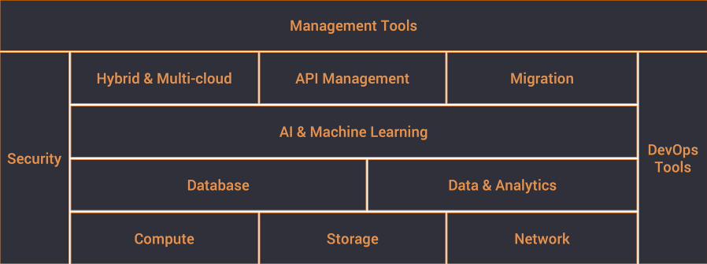
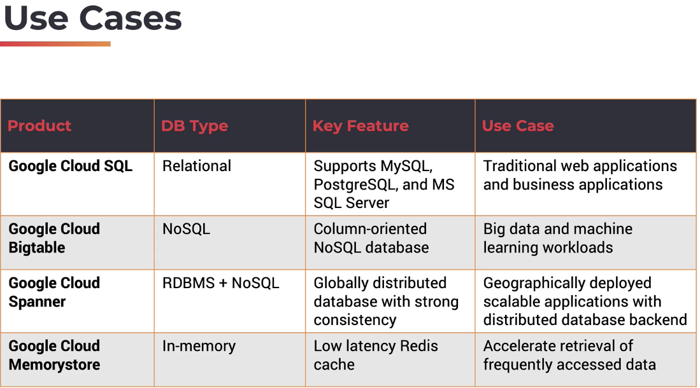
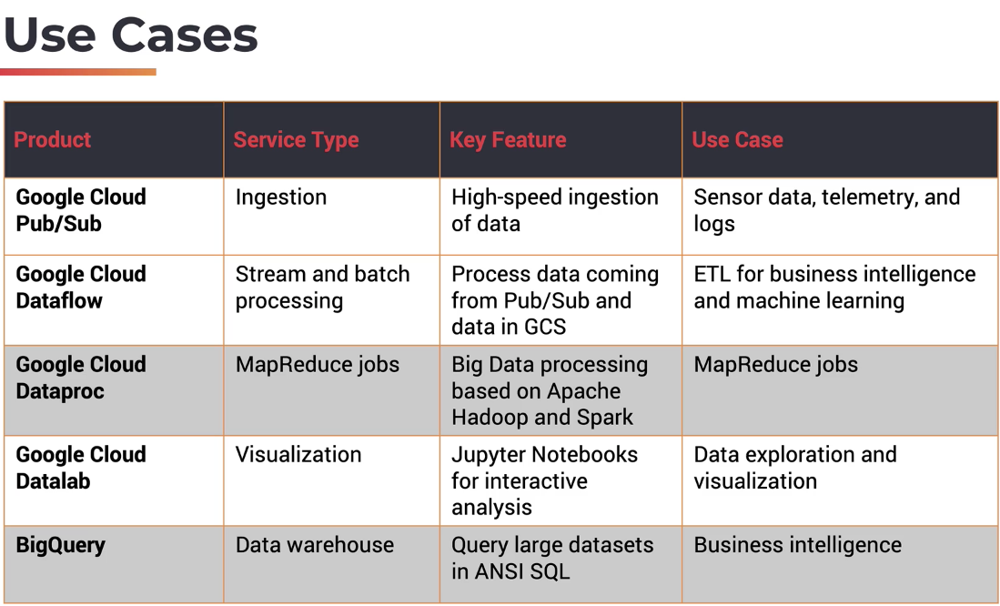
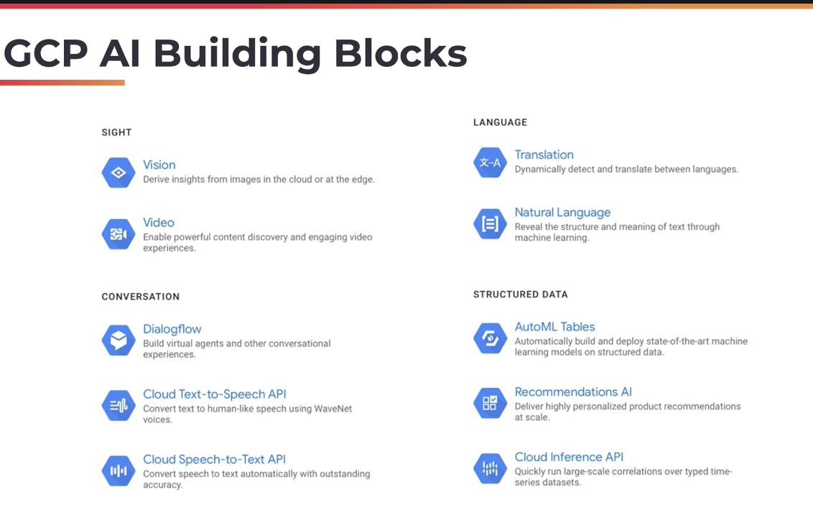

**GCP**

===

- [
**GCP**
](#div-aligncentergcpdiv)
- [Overview](#overview)
- [Compute](#compute)
  - [Traditional](#traditional)
  - [Serverless](#serverless)
- [Storage](#storage)
- [Database services](#database-services)
- [Data Analytics services](#data-analytics-services)
- [AI and Machine Learning services](#ai-and-machine-learning-services)
- [Cloud DevOps services](#cloud-devops-services)
- [Sources, References, and Resources](#sources-references-and-resources)

<figure>
  
  <figcaption>Source (2)</figcaption>
</figure>

# Overview
Organizations and Folders only exist within a GSuite account.

<figure>
  
  <figcaption>Source (2)</figcaption>
</figure>

# Compute 
## Traditional
<dl>
  <dt>Google Compute Engine</dt>
  <dd>VM-based compute (~ AWS EC2)</dd>
  <dt>Google Kubernetes Engine</dt>
  <dd>Managed Kubernetes cluster (~ AWS EKS)</dd>
</dl>

## Serverless

<figure>
  
  <figcaption>https://cloud.google.com/serverless-options/</figcaption>
</figure>
<dl>
  <dt>Google App Engine</dt>
  <dd>*Serverless*, container-based compute platform (~ AWS Fargate)</dd>
  <dt>Google Cloud Functions</dt>
  <dd>Serverless, prebuilt execution environment (~ AWS Lambda)</dd>
  <dt>Cloud Run</dt>
  <dd>Container-based compute accessible over HTTPS or pub/sub</dd>
</dl>

# Storage 
<dl>
  <dt>Google Cloud Storage</dt>
  <dd>Basic object store (~ AWS S3), with different storage classes depending on required access frequency</dd>
  <dt>Persistent Disk</dt>
  <dd>Block storage for VMs (~ AWS EBS).  This offering is unique in allowing multiple reader access to a single disk</dd>
  <dt>Google Cloud Filestore</dt>
  <dd>Managed NFS file system (~ AWS EFS) that allows legacy (file system based) software to run in the cloud</dd>
</dl>

# Database services

<figure>
  
  <figcaption>Source (2)</figcaption>
</figure>
<dl>
  <dt>Google Cloud SQL</dt>
  <dd>Basic RDBMS offering (~ AWS Aurora)</dd>
  <dt>Cloud Bigtable</dt>
  <dd>NoSQL database, equivalent to DynamoDB.  Column-oriented database that supports MapReduce operations and stream processing</dd>
  <dt>Cloud Spanner</dt>
  <dd>Relational database (ACID) that can scale horizontally</dd>
  <dt>Cloud Memorystore</dt>
  <dd>Fully-managed in-memory data store that implements the Redis protocol</dd>
</dl>

# Data Analytics services
<figure>
  
  <figcaption>Source (2)</figcaption>
</figure>
<dl>
  <dt>Cloud Pub/Sub</dt>
  <dd>Managed service to ingest data at scale, based on publish/subscribe model</dd>
  <dt>Cloud Dataflow</dt>
  <dd>Managed instance of Apache Beam, which is a service for defining transformation pipelines</dd>
  <dt>Cloud Dataproc</dt>
  <dd>Managed Hadoop and Spark cluster environments</dd>
  <dt>Cloud Datalab</dt>
  <dd>Managed jupyter notebook platform that can easily interop with GCP compute and storage services</dd>
  <dt>Cloud BigQuery</dt>
  <dd>Serverless, scalable cloud data warehouse that supports SQL queries</dd>
</dl>

# AI and Machine Learning services
<figure>
  
  <figcaption>Source (2)</figcaption>
</figure>
<dl>
  <dt>Cloud Building Blocks</dt>
  <dd>REST API endpoints for common ML tasks like image tagging and text extraction</dd>
  <dt>Cloud AutoML</dt>
  <dd>Mananged service to train a predefined model architecture (e.g. a CNN for vision tasks) using a custom dataset</dd>
  <dt>Cloud AI Platform</dt>
  <dd>Managed Kubeflow instance, which supports the entire Data Science workflow</dd>
  <dt>Cloud AI Hub</dt>
  <dd>Hosted repository for AI components (e.g. github for models, datasets, pipelines, etc)</dd>
</dl>

# Cloud DevOps services
<dl>
  <dt>Cloud Source Repositories</dt>
  <dd>Private git repository, integrated with GCP's CI/CD services</dd>
  <dt>Google Cloud Build</dt>
  <dd>The CI/CD offering on GCP.  It is integrated with source code repos and Docker</dd>
  <dt>Google Container Registry</dt>
  <dd>Docker container image registry</dd>
</dl>

# Sources, References, and Resources
1. [Official GCP Documentation](https://cloud.google.com/docs)
2. [Udemy Google Cloud Platform (GCP) Fundamentals for Beginners](https://www.udemy.com/course/google-cloud-platform-gcp-fundamentals-for-beginners/)
3. [Cloud Comparison chart](http://comparecloud.in/)