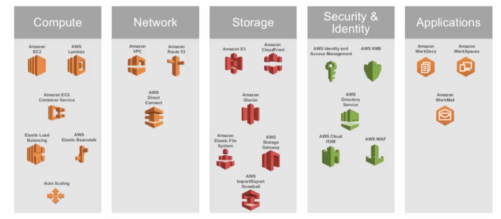
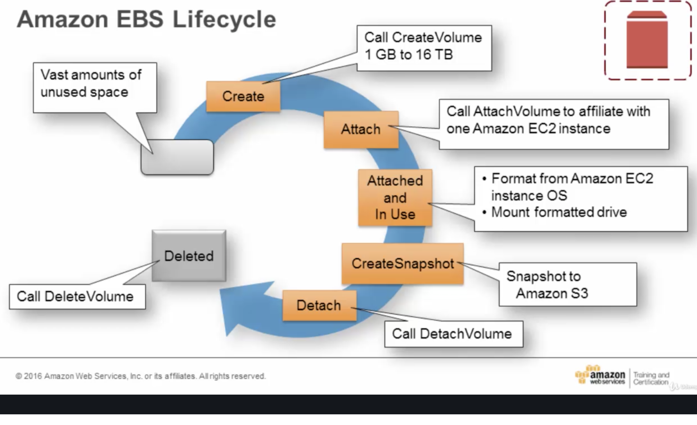
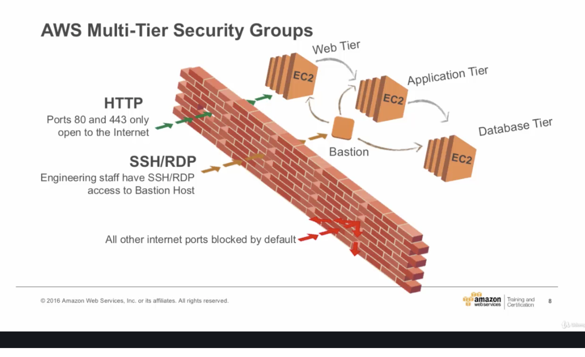
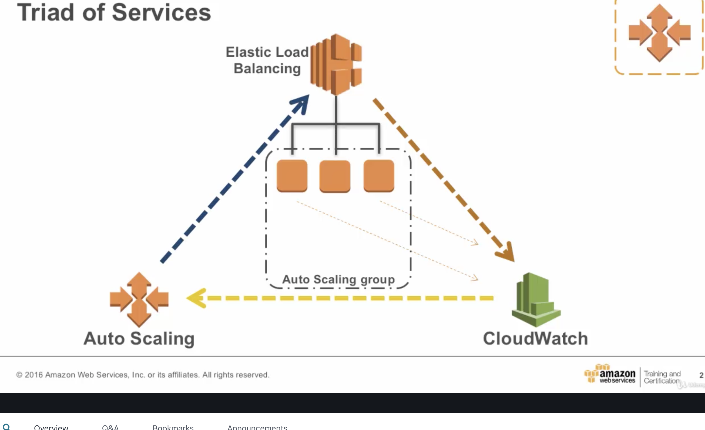

# AWS Foundational Services

*AWS service categories*

## Regions and availability zones
Regions are geographical areas that contain groups of availability zones, usually $2 \leq x \lt 6$.  An availability zone is a single data-center.  All availability zones in a region are geographically distinct but connected with low latency, high bandwidth network infrastructure.  A region name is typically of the form *ap-us-ohio-2*, which has the availability zone (2) embedded in the region name.

Many AWS services are regional services but some, including IAM, are global.

## Compute Services
EC2 - Ephemeral Storage (e.g. logs and generated files)
EBS - Persistant Storage (e.g. logs and generated files)

Rebooting - When you reboot an instance, the DNS name and server are preserved.  When you stop and start an instance, a new server and DNS name are allocated.

You can get instance metadata from within the instance by making an http request: 
`$curl http://169.154.169.254/latest/meta-data`

You can provide a script to generate user data ... less sure about the usefulness of this feature.  You can access user data with an http request: 
`$curl http://169.154.169.254/latest/user-data`

## Storage Services
### S3 - Secure Storage Services
- 1 bucket per customer; does that ensure an adequate amount of seperation?

3 levels of storage according to the desired access frequency.  Option to archive to the glacier tier.

Objects (file and meta) are automatically versioned.

#### Security overview
- IAM - User level access for users within your account
- Access Control List - Account level access
- Bucket policies - control access within the context of a specific bucket

### EBS - Elastic Block Storage
Block level storage (a stream of bytes, think of it as a hard drive).

Attaching an EC2 instance to an EBS instance will decouple the life cycle of the EC2 compute resource from that of the data.  When compute is done and the EC2 instance expires, the file store will still exist (in case you generate a file there or need to see the logs).

# Security

## Security groups
Security groups serve a role similar to a firewall in the application, limiting the Ingress and Egress of a service. Each instance can have its own security group, limiting how information can flow through the system.  Below is an example of a multi-tiered system, where the Web tier has a security group that enables Ingress via HTTP(S) and limits Egress to the Application tier, the Application tier accepts Ingress from the Web tier and Egress to the Database Tier, and the Database tier accepts Ingress from the Application tier.  A bastion server has another security group which allows engineers SSH access to all Tiers.

*Multi-tiered security groups*

## IAM - Identity and Access Management

### Policies
Policies are documents that explicitly list permissions.  Policies are then assigned to IAM users, groups, or roles.  Some services allow for resource-based policies, allowing them to sidestep the need to IAM access.

#### IAM Role
While Users are tied to specific individuals, roles are sets of policies which can be **assumed** by different persons or processes at different times (often temporarily).  They do not have associated credentials until they are assumed by a user.

### IAM Users
- Users can be given access keys and secret access keys to allow users to login via SDK or CLI
- Users can be assigned to groups, making it easy to manage permissions

- Manage IAM roles and their permissions
- Manage Federated users (single sign on) and their permissions

## Best practices
- Delegate by using roles instead of sharing credentials
- Use groups extensively

# DynamoDB
## Basics
A Table (Mongo Collection) is a collection of Items (Documents) which are collections of attributes (key value pairs). Each table has a primary key, a value in each Item that uniquely identifies that item.

#### Primary Keys
A Primary key uniquely identifies an Item in a Table.  A primary key can come in 2 varities, as a partition key or composite key.
- Partition key - a single attribute which is hashed and used to determine the node on which the Item is stored.  DynamoDB maintains an index for the partition key
- Composite key - A partition key and a sort key, both of which are indexed attributes.  All values with an identical partition key are then sorted according to the sort key.  The composite key + sort key value must be globally unique.

#### Local Secondary Index
Each table can have up to 5 Local Secondary Indices.  A Local Secondary Index is an indexed attribute which acts as the sort key, so the index will have the same partition key as the original table.
#### Global Secondary Index
A global secondary index is a projection of the tables attributes and can have a partition key and sort key that differ from that of the original table.

## Operations
### Query
Queries use the partition and optional sort key to locate records.  These can be executed on the table itself or on a secondary index.

# Elasticity and monitoring

*Autoscaling and monitoring triad*

### Auto Scaling
In addition to standard AWS parameters, one specifies *min_instances*,*max_instances*,and *desired_capacity* to configure the instance.  Nothing special here.

### Elastic Load Balancing
Standard load balancing, checks services and routes work to healthy nodes which are below capacity.

### CloudWatch
The main monitoring system for AWS systems.  In addition to providing a dashboard for your systems, you can also set alarms to do things like triggering autoscale or sending an email if issues occur.

### Trusted Advisor
Scans your resources and flags potential issues.  A linter for AWS, essentially.