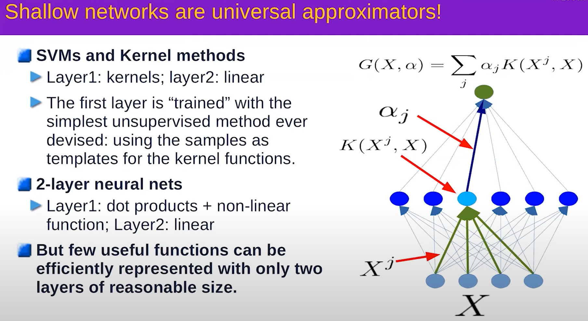

# Gradient Descent
## Gradient Descent
- Full Gradient descent - Gradient is calculated *across all* samples before any weights are updated
- Stochastic Gradient Descent - Gradient is calculated and weights are updated after *each* sample
- Mini-Batch - Gradient is calculated over batch_size samples before weights are updated

Stochastic Gradient descent converges faster and is theoretically equivalent to Full Gradient descent, so it is preferred.  Mini-Batch allows for the easy distribution of work across cores/machines, so it is almost universally used in practice.

Local optima are not really an issue when the dimensionality of the hypothesis space is so high, since your search will basically move around any local optima in a subset of the space since other variables will be moving it.  Easy example is to think of a 2D plane with a local optima.  Obviously, you could get stuck there.  If you add another dimension, the slump becomes a saddle point and no longer a trap.

The cost function does not need to be convex in order

Batch size should be $\leq 2*k$, where k is the number of categories for your classifier.

### Tips and Tricks
- Use ReLu
- Initialize the weights intelligently
- Use cross-entropy loss for classification
- mini-batch stochastic gradient descent
- Shuffle the training examples
- Normalize input variables (0 mean, unit variance)
- Schedule to decrease the learning rate
- L1 or L2 regularization of weights
  - Best to apply after a couple of epochs
- Use dropout for regularization

## Representation Learning

TODO - kind of want to do some additional research here, this idea that was mentioned was that a simple neural network could be used to transform a dataset into one that could be linearly seperable, which is to say that it could be an effective method for automatic feature extraction/enrichment.

A network with a single hidden layer can approximate any function, provided that the hidden layer is large enough.  Multiple hidden layers are used in practice because they often significantly reduce the number of nodes/weights needed to learn a function and not because of any limitations in the representative power of a 2-layer neural network.

The intuition behind why having N hidden layers might reduce network size is owing to the compositionality of many of the domains in which we are interested.  Natural language consists of phenomes, words, clauses, sentences, ...  As such, earlier layers in a feedforward network can learn to transform input into the more basic elements, with subsequent layers learning only how to deal with more abstract constructions, like clauses.

### ANNs as Rotating and Squashing
A simple neural network follows the pattern:

$\vec{x} \rightarrow \boxplus \rightarrow \diagup \rightarrow \boxplus \rightarrow \diagup \dots \vec{y}$
, where $\boxplus$ is a linear transformation (i.e. space rotation, shear, reflection, scale) and $\diagup$ is a non-linear transformation (i.e. ReLu or Tanh).

The intuition behind this is that internal nodes of the model are learning how to transform the input vector space from a high density cloud in N-dimensional space to a larger set of isolated high density clouds (ideally, each cloud contains all instances of a single class, with one cloud per class, and clouds are linearly seperable) in D-dimensional space, where $D \gt N$ will typically be the case.  A standard linear classifier is then applied to this distorted space.

# Activation and Cost functions
 

## Problem of the Vanishing Gradient
$Tanh$ and $sigmoid$ are virtually identical and are useful as smooth, continuous, differentiable squashing functions.  However, the very fact that they squash the output is a huge issue with deeper neural networks, where this behavior compounds across layers and leads to what is known as a *vanishing gradient*.

Imagine a 5 layer network with 5 nodes (1 node per layer to make a simple line).  Compounding the $tanh$ operation for a prediction error of 100 yields the sequence [100, 1, 0.76, 0.64, 0.57], so the error signal (the gradient) is tiny after the fourth layer even though a single node accounts for all the error at each layer. For this reason, ReLu and its variants are the popular choice for deeper networks, since they do not squash the error signal.

## Softmax (softargmax)
Function that maps a vector of real numbers $\vec{v}$ to another vector of real numbers $\vec{x}$ such that all values in $\vec{x}$ are in the range [0, 1] and $\sum{\vec{x}}=1$.  In other words, $\vec{x}$ has the properties of a probability distribution function over a discrete set of outcomes.

$$\dfrac{e^{z_i}}{\sum_{j=1}^k{e^{z_j}}} $$

Softmax converts a vector of K real numbers into a *probability distribution* of K possible outcomes. It is a generalization of the logistic function to multiple dimensions and is used in multinomial logistic regression.

## Cost Functions
Sum Squared error is good for regression, cross entropy loss for classification
TODO need more info on intuition behind cross entropy loss

# Architectures
Mixture of experts with an attention module as the switch which controls which system gets used.
Important to know that the switch component is trained as part of training the system.

## Recurrent Networks
LSTM was once very popular but the attention mechanism (and transformer architecture) have supplanted it
## Convolutional Networks

Where convolution layers exploit proximal regularity (pixels that are close together are usually similar) of images (or other inputs with this property) to reduce the number of weights needed (effectively downsampling the image).
Pooling is used to make the system a little less strict on the location of motifs (e.g. the corners of a C character), allowing CNNs to be more robust to variations in orientation of an image.

### CNN Configurations

### Notes
It is interesting to consider that part of what makes a network useful is the ability not to learn every single detail about examples, but rather to be able to detect similar substructures in the data.  This might be why not everyone has perfect recall, since saving all details might inhibit the ability to generalize.  I am not really sure here, I am mostly trying to compensate for my mediocre recall and make it appear to be a strength.

# Energy based models
Lots of math behind this, but the basic idea is that requiring a probabilistic interpretation of ANNs limits the kinds of problems that we can solve, or at least makes them theoretically unintuitive.  Instead, we can think of the training of an ANN as the construction of an energy topology, where the energy is minimized in areas that correspond to values of our function (this could even be as abstract as a correspondance with reality theory of belief, where I/O pairs are used as discrete measurements of correspondance) and elevated elsewhere.

There are two classes of learning methods for such systems:
- Contrastive
  - Push down on positive sample pairs, push up on negative examples
- Regularized/Architectural Methods
  - Build $F(x,y)$ so that the volume of low energy regions is limited or minimized through regularization.

### Contrastive
Different ways to pick which points to push up
1. Push down of the energy of data points, push up everywhere else
   1. Max likelihood (needs tractable partition function or variational approximation)
2. Push down of the energy of data points, push up on chosen locations
   1. Max likelihood with MC/MMC/HMC, Contrastive divergence, Metric learning/Siamese nets, Ratio Matching, Noise Contrastive Estimation, Min Probability Flow, adversarial generator/GANS
3. Train a function that maps points off the data manifold to points on the data manifold
   1. Denoising auto-encoder, masked auto-encoder (e.g. BERT)
### Regularized/Architectural
Different ways to limit the information capacity of the latent representation
1. Build the machine so that the volume of low energy space is bounded
   1. PCA, K-means, Gaussian Mixture Model, Square ICA, normalizing flows...
2. Use a regularization term that measures the volume of space that has low energy
   1. Sparse coding, sparse auto-encoder, LISTA, Variational Auto-Encoders, discretization/VQ/VQVAE.
3. F(x,y) = C(y, G(x,y)), make G(x,y) as "constant" as possible with respect to y
   1. Contracting auto-encoder, saturating auto-encoder
4. Minimize the gradient and maximize the curvature around data points
   1. score matching

A conceptual model of a denoise autoencoder (e.g. the BERT system) looks like:

This system is trained to map a corrupted (e.g. zoom or rotate scene, mask words, ...) version of its input, $y'$ back to the original input, $y$.  This works well on discrete domains, even where the cardinality is large (e.g NLP), but not on continuous domains like image recognition.

The intuition behind this has to do with the idea of building negative examples.  To build a good model, you must be able to represent all of the various ways of distorting $y$ such that $\hat{y}$ is no longer equivalent to $y$.  For NLP, you can do that by plugging in all other terms from your vocabulary into the masked location, whereas there is no equivalent for an image.

### Tips
When training a denoising autoencoder, it is not enough to feed the system pairs of (I, distorted(I)) to learn, since it can simply learn to ignore the input altogether and always produce True.  Instead, you must also give it negative examples, (I, not(I)), so that the system can learn to discriminate.

How does that work within the framework of probabalistic models?  An auto encoder will take input I or distorted(I) and produce I, but what should it do for negative examples?  Produce anything other than I?  Produce something far (how far) away from I?  Perhaps this is the motivation for energy, vs probability, based models?

### Deriving Negative Examples
  
Barlow Twins

## Regularized Architectural Models
- A1 : Build the machine so that the volume of low energy space is bounded
  - PCA, K-means (K limits volume), Gaussian mixture model (Requirement of forming a PDF limits volume)
- A2 : Use a regularization term in your energy function to penalize the 'volume' of the low energy portion of your manifold.
  - Sparse auto-encoder, LISTA, Variational Auto-Encoders

# Joint Embedding
Joint embedding is a technique used to associate data from different domains (e.g. voice and picture for personal identity).  The idea is to train a model to create low dimensional embedding spaces where embeddings of the same identity lie close together, and embeddings of different identities are far apart.

Note that the Barlow Twins architecture could be used for this

# Self supervised Learning

1. Learning hierarchical representations of the world
   - SSL pre-training preceds a supervised or RL phase
2. Learning a predictive (forward) model of the world
   - Learning models for Model-Predictive Control, policy learning for control, or model-based RL

Outstanding question: How to represent uncertainty and multi-modality in the prediction

# Generative Adversarial Networks
The critic acts as a dynamic (learning) loss function for the Generator ... ?

Generator - maps a random/noise vector to the domain of interest (e.g. 2D images)

Training - rotate between training the generator with a fixed discriminator network and training the discriminator with a fixed generator network
- GANs have been found to be useless for representation learning

# Sources
1. [NYU Deep Learning SP21](https://cds.nyu.edu/deep-learning/)
2. [Essense of Linear Algebra](https://www.youtube.com/watch?v=fNk_zzaMoSs&list=PLZHQObOWTQDPD3MizzM2xVFitgF8hE_ab&pp=iAQB)
