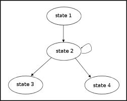
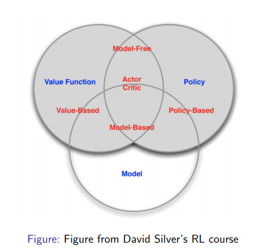

# Introduction
References: http://web.stanford.edu/class/cs234/CS234Win2019/slides/lecture1.pdf

## Terms and notation

### Terms
 - Agent - Stateful, takes actions and receives observation and reward
 - Environment - Stateful, generates observations and rewards based on agent activities
 - Markov Property - The future is independent of the past given the present.  In other words, the current state contains all relevant information (there is no information in previous states).
 $$P(s_{t+1} | s_t)=P(s_{t+1} | s_1,...,s_t)$$
 
### Notation
 - $s_t$ - State at time $t$
 - $a_t$ - Action at time $t$
 - $r_t$ - (expected) Reward at time $t$
 - $\pi$ - Convention for default policy
 - $P(x)$ - Probability of event x

## Sequential Decision Processes

For phenomena over which we believe that the markov property holds, we can assert that there is a certain probability of each particular state, $s'$, occuring after the next time step, given a current state $s$.  Let us label this as $P_{ss'}$ and state it formally as: 
$$\rho_{ss'} = P(s_{t+1} = s' | s_t = s)$$
 
We can now define a __State Transition Matrix__ as the matrix whose entry at index N,M is $\rho_{NM}$.  So a row of the matrix should be a probability distribution (sums to 1) for the transition from $s_t$ to $s_{t+1}$.

### Markov Decision Processes (MDP)
A __Markov Process__ is a memoryless random process, i.e. a sequence of random states $s_1,s_2, ...$ with the Markov property.  More formally, a markov process is a finite state machine consisting of a finite set of states, S, and a state transition matrix, P, that defines the weights of each edge/link.

#### SubTypes
- Full observable (MDP)- World state is known (so environment state = world state)
- Partially observable MDP (POMDP) - World state is unknown, only know limited portion of it (e.g. poker player only knows their own hand)

Since actions influence future observations (by changing the world in a significant way), there is often a need for credit assignment and strategic action.
### Bandits
- Bandits - Actions have no influence on future observations (so there are no delayed rewards)

## Components of RL algorithms
### Model
The agent's representation of how the world changes in response to its action.
- A transition model predicts next agent state after taking an action
- A reward model predicts the immediate reward of taking an action

### Policy
The policy, $\pi$, determines how the agent chooses actions.  Could be deterministic or stochastic.
- $\pi:States\rightarrow Actions$

### Value Function
Future rewards derived from being in a certain state under a particular policy
- The value function $V^{\pi}$ is the expected discounted sum of future rewards under a policy $\pi$
$$V^{\pi}(s_t=s) = E_{\pi}[r_t + \gamma r_{t+1} + \gamma^2 r_{t+2} + \gamma^3 r_{t+3} + ... | s_t = s)]$$
- Discount factor is $\gamma$.  Future states are discounted to reflect uncertainty
- Used to gauge longer term effects of actions

## Types of RL agents

##### Model based
An explicit model is used to determine the appropriate actions.  The model can be used to compute a policy and/or value function.

##### Value based
A value function is used to determine the appropriate actions (a policy can be derived from the value function)

##### Policy based
A policy is used to determine the appropriate actions in the absence of a value function

##### Actor-Critic
A policy and value function are used to determine the appropriate actions

##### Alternative
Algorithms can also have an explicit model, value function, and policy

## Types of Machine Learning
#### Reinforcement learning
- Optimization
- Delayed consequences
- Exploration
- Generalization

#### AI Planning
- Optimization
- Generalization
- Delayed Consequences

AI planning must compute good sequences of decisions but does so with a high fidelity model of how decisions will impact the world (think constrained, known domains like board games)

#### Supervised Machine Learning
- Optimization
- Generalization

Learns form experience but must be provided with correct labels/credit assignments

#### Unsupervised ML
- Optimization
- Generalization

Learns from experience but cannot use labels from the world or output meaningful ones

#### Imitation Learning
- Optimization
- Generalization
- Delayed Consequences

Learns from the experience of others via (input) demonstrations of good policies in diverse situations.  Reduces reinforcement learning to supersupervised learning.

# Multi-armed Bandits
##### Problem Definition
An agent is faced with a choice among $k$ different options and will receive a numerical reward chosen from a static probability distribution based on the action.  The goal is to maximize total reward after some period of time (number of time steps).  The problem here is that we do not know the action -> reward mapping (the world state); the agent must take actions and build an internal model of the mapping as it explores.  In the meantime, it is also trying to maximize total reward; as a result, it must trade off between exploring (and possibly improving its model of the world) and exploiting (taking an action that results in the highest value according to its model).  In this scenario, your value function, denoted $q_*(a)$, can simply be the expected value of the reward : $q_*(a) = \sum_rp(r|a)r$

## Action-Value functions

An central problem in the bandit scenario is deciding how to assign a value to actions.  If we assume a stationary world (value from an action is independent of time) then a simple and obvious action value function would the _sample average_ function: the value associated with an action is the mean reward that has resulted from that action in the past.  
If a greedy selection algorithm is used then the agent will never learn a useful action-value function.  An alternative is to use a $\epsilon$-greedy approach, which involves selecting a random action with a probability of $\epsilon$.  A higher $\epsilon$ value will result in learning a more useful action-value function earlier but plateaus in the long run since it will ignore its accurate action-value function $\epsilon$ * 100 % of the time.  A simply strategy here is to reduce $\epsilon$ over time.

##### Optimistic Initial Values
Note that under a greedy scheme, if the initial values are set to 0 for all actions then the agent will always repeat the first action it takes ($r > 0$), since that action will have a non-zero score.  A way to get around that, and to at least sample everything once, would be to initialize values to very high levels.  That way, rewards (which will be much smaller than the initialized value) will decrease the mean value, making other actions more appealing (they still have their initial high values).

##### Sample Average
Sample average can be computed in constant time and memory by storing the previous average, $Q_n$, and the number of instances of action A, n.
$$Q_{n+1} = Q_n + \frac{1}{n}(R_n - Q_n)$$

##### Nonstationary case
If the reward associated with an action changes over time (which is very common in reinforcement learning tasks) then we probably want to weight more recent rewards more highly.  One way to do that is with an exponential-recency weighted average, which results from just adding a decay factor that applies to each step:
$$Q_{n+1} = Q_n + \alpha{R_n - Q_n}$$

With some algebra and substitution we see that this is equivalent to 

$$Q_{n+1} = (1-\alpha)^nQ_1 + \sum_{i=1}^n{\alpha(1-\alpha)^{n-i}R_i}$$

In words, the contribution of a single reward decays exponentially.  As a result, the initial estimate $Q_1$ becomes insignificant (contribution approaches 0) with a sufficient amount of data.

##### Upper confidence bound
A more complicated function that attempts to account for the uncertainty and greediness is the upper confidence bound:
$$A_t = argmax\left[Q_t(a) + c \sqrt{\frac{\ln t}{N_t(a)}}\right]$$
The square root value represents uncertainty, with increasing exposure to an action (increase in $N_t(a)$) lowering the term but more time increasing (albiet slowly) the term.  The $Q_t(a)$ term represents greediness.  Since we will often take the greedy ($\epsilon < 0.5$), using this new term will favor exploration under uncertainty.  To see this, observe that our uncertainty term is relatively large when we have been through many sequences ($\ln t$) but only a few of them were for the associated action.  When the term is large, it increases the sum of our function and therefore the chance that it is the best action under an ($\epsilon$) greedy scheme.

# References

1. Stanford CS234 Reinforcement Learning Winter 2019.  Instructor: Emma Brunskill.  http://web.stanford.edu/class/cs234/CS234Win2019/
2. Reinforcement Learning: An Introduction, Sutton and Barto, 2nd Edition.
3. David Silver's course - http://www0.cs.ucl.ac.uk/staff/D.Silver/web/Teaching.html