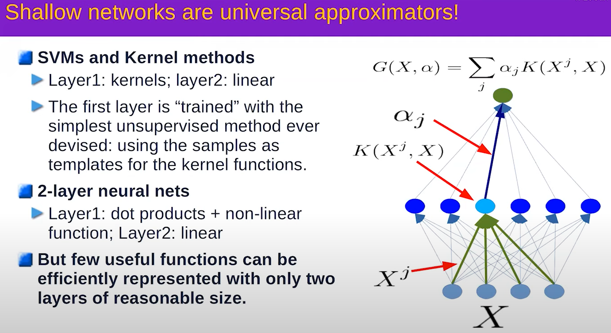

# Gradient Descent
## Gradient Descent
- Full Gradient descent - Gradient is calculated *across all* samples before any weights are updated
- Stochastic Gradient Descent - Gradient is calculated and weights are updated after *each* sample
- Mini-Batch - Gradient is calculated over batch_size samples before weights are updated

Stochastic Gradient descent converges faster and is theoretically equivalent to Full Gradient descent, so it is preferred.  Mini-Batch allows for the easy distribution of work across cores/machines, so it is almost universally used in practice.

Local optima are not really an issue when the dimensionality of the hypothesis space is so high, since your search will basically move around any local optima in a subset of the space since other variables will be moving it.  Easy example is to think of a 2D plane with a local optima.  Obviously, you could get stuck there.  If you add another dimension, the slump becomes a saddle point and no longer a trap.

The cost function does not need to be convex in order

Batch size should be $\leq 2*k$, where k is the number of categories for your classifier.

### TnT
- Use ReLu
- Initialize the weights intelligently
- Use cross-entropy loss for classification
- mini-batch stochastic gradient descent
- Shuffle the training examples
- Normalize input variables (0 mean, unit variance)
- Schedule to decrease the learning rate
- L1 or L2 regularization of weights
  - Best to apply after a couple of epochs
- Use dropout for regularization

## Representation Learning

TODO - kind of want to do some additional research here, this idea that was mentioned was that a simple neural network could be used to transform a dataset into one that could be linearly seperable, which is to say that it could be an effective method for automatic feature extraction/enrichment.

A network with a single hidden layer can approximate any function, provided that the hidden layer is large enough.  Multiple hidden layers are used in practice because they often significantly reduce the number of nodes/weights needed to learn a function and not because of any limitations in the representative power of a 2-layer neural network.

The intuition behind why having N hidden layers might reduce network size is owing to the compositionality of many of the domains in which we are interested.  Natural language consists of phenomes, words, clauses, sentences, ...  As such, earlier layers in a feedforward network can learn to transform input into the more basic elements, with subsequent layers learning only how to deal with more abstract constructions, like clauses.

# Activation and Cost functions
 

## Vanishing Gradient
$Tanh$ and $sigmoid$ are virtually identical and are useful as smooth, continuous, differentiable squashing functions.  However, the very fact that they squash the output is a huge issue with deeper neural networks, where this behavior compounds across layers and leads to what is known as a *vanishing gradient*.

Imagine a 5 layer network with 5 nodes (1 node per layer to make a simple line).  Compounding the $tanh$ operation for a prediction error of 100 yields the sequence [100, 1, 0.76, 0.64, 0.57], so the error signal (the gradient) is tiny after the fourth layer even though a single node accounts for all the error at each layer. For this reason, ReLu and its variants are the popular choice for deeper networks, since they do not squash the error signal.

## Softmax (softargmax)
Function that maps a vector of real numbers $\vec{v}$ to another vector of real numbers $\vec{x}$ such that all values in $\vec{x}$ are in the range [0, 1] and $\sum{\vec{x}}=1$.  In other words, $\vec{x}$ has the properties of a probability distribution function over a discrete set of outcomes.

## Cost Functions
Sum Squared error is good for regression, cross entropy loss for classification
 TODO need more info on intuition behind cross entropy loss

# Architectures
Mixture of experts with an attention module as the switch which controls which system gets used.
Important to know that the switch component is trained as part of training the system.
