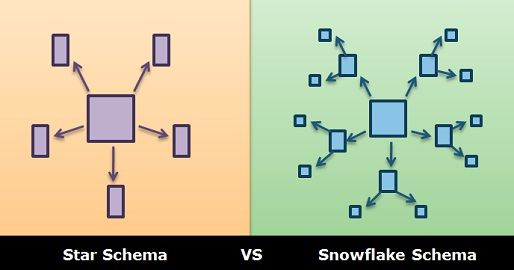
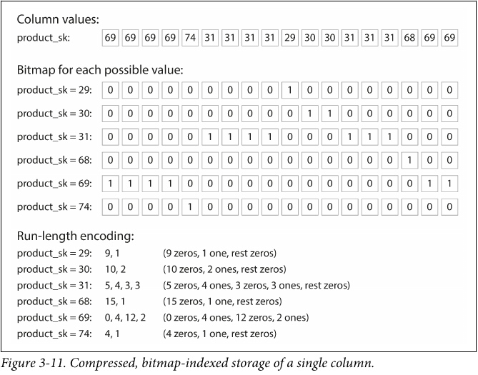
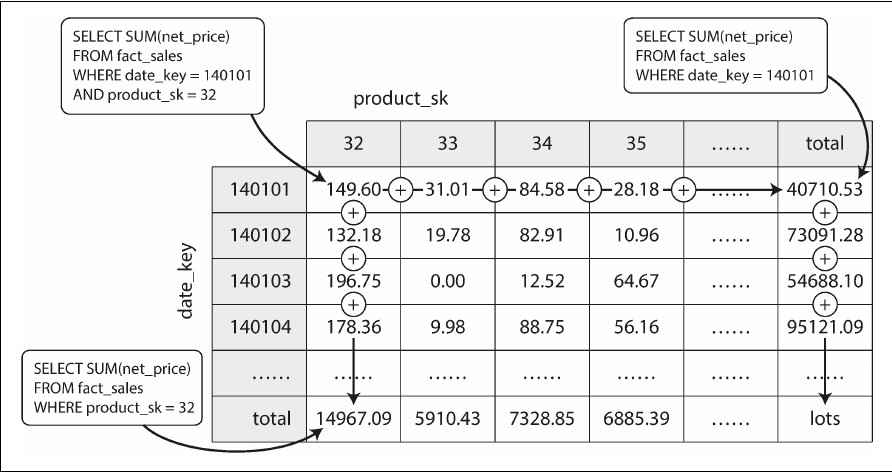

- [Design Principles and Goals](#design-principles-and-goals)
  - [Reliability](#reliability)
  - [Scalability](#scalability)
  - [Maintainability](#maintainability)
    - [Operability](#operability)
    - [Simplicity](#simplicity)
    - [Evolvability](#evolvability)
- [The Data Model](#the-data-model)
  - [Relational Data models](#relational-data-models)
    - [Heuristics](#heuristics)
  - [Document Data Models](#document-data-models)
    - [Strengths](#strengths)
    - [Weaknesses](#weaknesses)
    - [Caveats](#caveats)
  - [Graph Data Models](#graph-data-models)
    - [Property graph model](#property-graph-model)
    - [Triple stores](#triple-stores)
  - [Summary](#summary)
- [Storage and Retrieval](#storage-and-retrieval)
  - [Example System: Sequential File Write](#example-system-sequential-file-write)
    - [Strengths](#strengths-1)
    - [Weaknesses](#weaknesses-1)
  - [Example System: Hash Indexing (Log Structured Storage)](#example-system-hash-indexing-log-structured-storage)
    - [Strengths](#strengths-2)
    - [Weaknesses](#weaknesses-2)
  - [LSM Trees (SSTable)](#lsm-trees-sstable)
    - [Strengths](#strengths-3)
    - [Weaknesses](#weaknesses-3)
  - [B Trees](#b-trees)
  - [Advanced Indexing structures](#advanced-indexing-structures)
    - [Storing values with index](#storing-values-with-index)
    - [Multi-column indexes](#multi-column-indexes)
    - [In memory databases](#in-memory-databases)
  - [Transaction vs Analytics (OLAP vs OLTP)](#transaction-vs-analytics-olap-vs-oltp)
  - [Data Warehouses](#data-warehouses)
    - [Star and Snowflake Schemas](#star-and-snowflake-schemas)
    - [Column-oriented schemas](#column-oriented-schemas)
    - [Aggregated Views (Data Cubes)](#aggregated-views-data-cubes)
  - [Summary](#summary-1)
- [Encoding and Evolution](#encoding-and-evolution)
  - [Background and Terms](#background-and-terms)
  - [JSON, XML, CSV](#json-xml-csv)
    - [Binary variants](#binary-variants)
  - [DataFlow and Evolvability](#dataflow-and-evolvability)
    - [DataFlow via Databases](#dataflow-via-databases)
    - [Dataflow via APIs](#dataflow-via-apis)
    - [Message passing dataflow](#message-passing-dataflow)
  - [Summary](#summary-2)
- [Replication](#replication)
  - [Leader Follower Model](#leader-follower-model)
    - [Full synchronization](#full-synchronization)
    - [Semi-synchronous configuration](#semi-synchronous-configuration)
    - [Fully Asynchronous configuration](#fully-asynchronous-configuration)
    - [Node Failure Recovery](#node-failure-recovery)
  - [Replication Logs](#replication-logs)
    - [Statement replication](#statement-replication)
    - [Write-ahead log (WAL) shipping](#write-ahead-log-wal-shipping)
    - [Logical (row-based) log replication](#logical-row-based-log-replication)
    - [Triggered replication](#triggered-replication)
  - [Replication Lag](#replication-lag)
    - [Eventual Consistency](#eventual-consistency)
    - [Read what you write](#read-what-you-write)
    - [Monotonic Reads](#monotonic-reads)
    - [Consistent prefix](#consistent-prefix)
- [Appendix](#appendix)
  - [Bloom Filters](#bloom-filters)
  - [R-trees](#r-trees)
  - [Space filling curve](#space-filling-curve)


# Design Principles and Goals
## Reliability
One study of large internet services found that configuration errors by operators were the leading cause of outages, whereas hardware faults (servers or network) played a role in only 10–25% of outages.

How do we make our systems reliable, in spite of unreliable humans? The best systems combine several approaches:

- Design systems in a way that minimizes opportunities for error. For example, well-designed abstractions, APIs, and admin interfaces make it easy to do “the right thing” and discourage “the wrong thing.” However, if the interfaces are too restrictive people will work around them, negating their benefit, so this is a tricky balance to get right.
- Decouple the places where people make the most mistakes from the places where they can cause failures. In particular, provide fully featured non-production sandbox environments where people can explore and experiment safely, using real data, without affecting real users. 
- Test thoroughly at all levels, from unit tests to whole-system integration tests and manual tests. Automated testing is widely used, well understood, and especially valuable for covering corner cases that rarely arise in normal operation. 
- Allow quick and easy recovery from human errors, to minimize the impact in the case of a failure. For example, make it fast to roll back configuration changes, roll out new code gradually (so that any unexpected bugs affect only a small subset of users), and provide tools to recompute data (in case it turns out that the old computation was incorrect). 
- Set up detailed and clear monitoring, such as performance metrics and error rates. In other engineering disciplines this is referred to as telemetry. (Once a rocket has left the ground, telemetry is essential for tracking what is happening, and for understanding failures) Monitoring can show us early warning signals and allow us to check whether any assumptions or constraints are being violated. When a problem occurs, metrics can be invaluable in diagnosing the issue. 
- Implement good management practices and training … beyond the scope of this document

## Scalability 
Over the foreseeable lifetime of the application, which aspects are liable to rapid growth and which performance aspects need to stay relatively stable in those situations?  Examples might be:
- The sizes of data sets that need to be batch processed
- The number of simultaneous requests that need to be authenticated and processed with a given response time
- The geographical dispersion of nodes

It is standard practice to define Service Level Agreements (SLAs) to specify legally enforceable standards.  For instance, a company might promise that a service responds in less than 200 ms to 99.9% of requests and is subject to fines by clients if it fails to uphold that.

Amazon describes response time requirements for internal services in terms of the 99.9th percentile, even though it only affects 1 in 1,000 requests. This is because the customers with the slowest requests are often those who have the most data on their accounts because they have made many purchases—that is, they’re the most valuable customers!

Oftentimes, a system needs an architectural overhaul if load increases by an order of magnitude.  

## Maintainability
### Operability
Make it easy for operations teams to keep the system running smoothly.

Good operability means making routine tasks easy, allowing the operations team to focus their efforts on high-value activities. Data systems can do various things to make routine tasks easy, including:
- Providing visibility into the runtime behavior and internals of the system, with good monitoring 
- Providing good support for automation and integration with standard tools 
- Avoiding dependency on individual machines (allowing machines to be taken down for maintenance while the system as a whole continues running uninterrupted) 
- Providing good documentation and an easy-to-understand operational model (“If I do X, Y will happen”) 
- Providing good default behavior, but also giving administrators the freedom to override defaults when needed 
- Self-healing where appropriate, but also giving administrators manual control over the system state when needed 
- Exhibiting predictable behavior, minimizing surprises


### Simplicity 
Make it easy for new engineers to understand the system and for existing engineers to keep a working model of the system in their minds.

Limit accidental complexity, defined as that which is not inherent in the problem that the software solves (as seen by the users) but arises only from the implementation.

One of the best tools we have for removing accidental complexity is abstraction. A good abstraction can hide a great deal of implementation detail behind a clean, simple-to-understand façade. A good abstraction can also be used for a wide range of different applications.
 
### Evolvability
Make it easy for engineers to make changes to the system in the future, adapting it for unanticipated use cases as requirements change. Also known as extensibility, modifiability, or plasticity.


# The Data Model
The data model is probably the most crucial aspect of the design and will have the biggest impact on system performance and usability.

In essence, an application layer is nothing more than a data model and an API for manipulating that data model. Good modular design requires great data modeling

Every data model embodies assumptions about how it is going to be used. Some kinds of usage are easy and some are not supported; some operations are fast and some perform badly; some data transformations feel natural and some are awkward.

It can take a lot of effort to master just one data model (think how many books there are on relational data modeling). Building software is hard enough, even when working with just one data model and without worrying about its inner workings. But since the data model has such a profound effect on what the software layer above it can and can’t do, it’s important to choose one that is appropriate to the application. Custom data models force application developers to think a lot about the internal representation of the data in the database, which has a negative impact on evolvability, simplicity, and maintainability.

A problem that arises with using a generic persistence data model, such as their relational data model, is that there's often a translation that needs to occur between the application data model and the persisted data model. The difference between the two is known as the *impedance mismatch*. This often arises because your persistence layer is optimizing for on disk storage and generic queries, while your application layer is optimizing for developer and user convenience at the API level. Document stores, like MongoDB, use JSON, which can lower the *impedance mismatch*, at the cost of redundant data on disk.

## Relational Data models
### Heuristics
#### Use IDs and GUIDs for keys
The advantage of using an ID is that because it has no meaning to humans, it never needs to change: the ID can remain the same, even if the information it identifies changes.

Anything that is meaningful to humans may need to change sometime in the future and if that information is duplicated, all the redundant copies need to be updated. That incurs write overheads, and risks inconsistencies (where some copies of the information are updated but others aren’t). Removing such duplication is the key idea behind normalization in databases.

## Document Data Models
There are several driving forces behind the adoption of NoSQL databases, including:
- A need for greater scalability than relational databases can easily achieve, including very large datasets or very high write throughput 
- A widespread preference for free and open source software over commercial database products
- Specialized query operations that are not well supported by the relational model 
- Frustration with the restrictiveness of relational schemas, and a desire for a more dynamic and expressive data model
### Strengths
- Higher write throughput
- Typically easier to achieve horizontal scaling of the database
- More dynamic and expressive data model (can minimize impedance mismatch)
- Simplifies one-to-many modelling and gives a locality advantage if you frequently access something like person.address.zip_code (access from JSON vs 3 table join)
	
### Weaknesses
- Eventual consistency
- All of the caveats below
- Typically results in a less evolvable data model

### Caveats
- If joins are needed, application code must be written to do it (negatively affects maintainability, scalability, and evolvability)
- Even if the initial version of an application fits well in a join-free document model, data has a tendency of becoming more interconnected as features are added to applications (evolvability)
- Determining the “access path” for nested data needs to happen in application code, since a lack of schema prevents the use of automatic query optimizers
- The locality advantage only applies if you need large parts of the document at the same time.
  - Loading a single field typically requires loading the entire document
  - Updating a document typically requires rewriting the entire document

## Graph Data Models
### Property graph model
A property graph model is a collection of vertices and edges
Each vertex has a unique id, incoming edges, outgoing edges, and attributes (key-value pairs)
Each edge has a unique ID, start vertex, end vertex, and attributes (key-value pairs)

### Triple stores
In a triple-store, all information is stored in the form of very simple three-part statements: (subject, predicate, object). A triple might be (Jim, likes, bananas), (Jim,is,silly), (silly,type_of, personality).

## Summary
Document databases target use cases where data comes in self-contained documents and relationships between one document and another are rare

Graph databases go in the opposite direction, targeting use cases where anything is potentially related to everything

Relationals databases form a middle ground

# Storage and Retrieval
Key problems that a Database must solve
- Efficient storage on disk (Data format)
- Modifying existing records
- Adding new records
- Deleting records
- Retrieving the most accurate view of data
- Crash recovery 
- Partially written records (database may crash)
- Simultaneous users/Concurrency control (scale with # users and # records)

## Example System: Sequential File Write
Imagine a simple database, which consists of get(k) and set(k,v).  The set command appends a key value pair to a file, and the get command fetches the latest record associated with a key.
### Strengths
- Fastest possible writes
- Simple
### Weaknesses
- Extremely slow O(n) reads
- No storage reclamation
- Slow modification
- Potential issues with simultaneous use
## Example System: Hash Indexing (Log Structured Storage)
Create an in-memory hash index for records (key -> byte offset) and segment files (fixed length) instead of a single file.  Keys are stored in chronological order, so that the most recent entry for a key is in the most recent file.
### Strengths
- Fast reads
### Weaknesses
- Slightly slower writes (need to update the index)
- Limited scale since all keys must fit in memory
## LSM Trees (SSTable)
Take our log-structured storage segment, a sequence of key-value pairs appearing in the order that they were written, and *add a sorting requirement*: the sequence of key-value pairs is sorted by key.


We can now make our storage engine work as follows:
- When a write comes in, add it to an in-memory balanced tree data structure (e.g. a red-black tree). This in-memory tree is sometimes called a memtable.
- When the memtable gets bigger than some threshold, write it out to disk as an SSTable file.
  - While the SSTable is being written out to disk, writes can continue to a new memtable instance.
- In order to serve a read request, first try to find the key in the memtable, then in
the most recent on-disk segment, then in the next-older segment, etc
- From time to time, run a merging and compaction process in the background to
combine segment files and to discard overwritten or deleted values.
  - Start reading the SSTable files in parallel, looking at the first key in each file, and copy the lowest key to the output file.  Repeat until all keys are copied over, taking only the most recent instance of a particular key
  - 

### Strengths
- Scales to large datasets
- Easy to perform range queries
- High write throughput since writes are sequential
- LSM-trees can be compressed better, and thus often produce smaller files on disk
than B-trees.  Since LSM-trees are not page-oriented and periodically rewrite SSTables to remove fragmentation, they have lower storage overheads, espe‐
cially when using leveled compaction
- Typically lower write duplication/amplification (for each user write to DB, how many times does the system write that data)
### Weaknesses
- Looking up non-existent keys can be very slow
  - A [bloom-filter](#bloom-filters) can be used to mitigate the costs
- Compaction process can limit write throughput since it competes for write resources
- In configuration is setup incorrectly for use case, databases can grow indefinitely as writes/modifications happen faster than compaction (and duplicate key removal)
- Newer technology, so implementations are not as mature as B-Tree systems
- Reads are typically slower on LSM-trees since they have to check several different data structures and SSTables at different stages of compaction.

## B Trees
Store keys using a B tree
[Btree](../Computer_Science/resources/images/BTree.png)


## Advanced Indexing structures
### Storing values with index
An index can be concieved of as a key/value pair.  In many instances, the key (e.g. index column) is stored with a pointer to the corresponding value (e.g. DB row), which is typically stored in a *heap file*.  This works very well for fixed size records, where values within records can change without changing the block size of that record.

In some situations, the extra step to lookup values by heap file pointer is prohibitive and indexed values are stored alongside the index.  This type of index is known as a **clustered index**.  When only a subset of the record's fields are stored with the index, it is known as a **covering index** and queries that can be answered by using this index alone (without looking up additional values from the row) are said to be *covered*.

### Multi-column indexes
Queries that are a function of multiple attributes cannot always be made efficiently with independent, single key indices.  Additionally, simple solutions like concatenating fields into a single key can be of limited use (e.g. last_name + first_name can be used to query for full names or last names, but not first names).
#### Geospatial Indices
Geospatial indices require a search on 3 values (x,y,z) simultaneously, making traditional single key indices useless.  Some solutions to this problem are:
- Use a [space-filling-curve](#space-filling-curve) to generate a single index value, then a traditional B-tree index
- Use a specialized spatial index, like an [R-tree](#r-trees)

### In memory databases
In memory databases are more performant, when they are feasible for the domain dataset sizes, primarily because they avoid the overhead of encoding in-memory data structures to disk compatible forms.
Examples:
- VoltDB, MemSQL, and Oracle TimesTen are in-memory relational databases
- RAMCloud is an open source, in-memory key-value store with durability 
- Redis and Couchbase provide weak durability with asynchronous disk writes

## Transaction vs Analytics (OLAP vs OLTP)
Originally, databases were used to record single events (e.g. customer transactions) and retrieve those events at a later point in time, typically for display or audit purposes.  In this case, small groups of entire records are retrieved at any given time. This pattern of on-demand access (e.g show all my purchases for May 2022) is known as *online transaction processing* (**OLTP**).  Systems typically interact with the data in a transactional way.
With faster computers and more extensive digital records, databases are increasingly subject to large analytic queries that help drive executive decisions (e.g. total sales by region and demographics).  Such queries require a very different access pattern, typically of the form of accessing a few fields across all records in a database.  This access pattern is known as *online analytic processing* (**OLAP**).  BI analysts typically interact with the data using the OLAP system.

| Property             | Transactions (OLTP)                               | Analytics (OLAP)                          |
| -------------------- | ------------------------------------------------- | ----------------------------------------- |
| Main read pattern    | Small number of records per query, fetched by key | Aggregate over large number of records    |
| Main write pattern   | Random-access, low-latency writes from user input | Bulk import (ETL) or event stream         |
| Primarily used by    | End user/customer, via web application            | Internal analyst, for decision support    |
| What data represents | Latest state of data (current point in time)      | History of events that happened over time |
| Dataset size         | Gigabytes to terabytes                            | Terabytes to petabytes                    |

---

While relational databases can be used for both OLAP and OLTP, many companies use separate database systems for OLAP, termed **data warehouses**.

## Data Warehouses
An enterprise may have dozens of different transaction processing systems: - systems powering the customer-facing website and controlling point of sale (checkout)
systems in physical stores, tracking inventory in warehouses, planning routes for vehicles, managing suppliers, administering employees, etc. Each of these systems is complex and has its own administrators, who are often not eager to let analysts run arbitrary queries across it during business hours.

To support the OLAP paradigm, a read-only copy of the data (the warehouse) is created from all the various OLTP systems in the company.  The warehouse build process is an example of an ETL:
- (E)xtract the data from OLTP systems, with some combination of periodic data dumps and continuously streamed updates
- (T)ransform the data into an analysis-friendly schema
- Clean the data with OLTP specific logic to remove or complete missing records
- (L)oad the resulting data into the data warehouse.

### Star and Snowflake Schemas
Since the data warehouse is setup for arbitrary queries, its data is stored in a very generic format, a highly normalized relational table form.  The standard schema, in which *events* as stored as rows in a **fact** table, with individual columns containing atomic values (e.g. price or quantity) or foreign key references to complex values (**dimensions**, such as the `product purchased` or `location of sale`), is known as a **star** schema since it has a unifying/central concept (an event/fact) surrounded by a single layer of supporting dimension tables.  If the dimension tables themselves contain complex attributes (i.e. foreign key references to other tables), then the schema is known as a **snowflake** schema.



### Column-oriented schemas
Column oriented data storage is popular for data warehouses owing to the facts that:
- Event tables typically have many columns, but only a few are used in any query
- Column data is homogenous
  - Each cell takes up the same space
  - Typically redundancy, which lends itself to better compression
Note that while an arbitrary scheme can be used for ordering rows, that scheme must be applied to all column stores such that element[i] of column[0] must correspond to the same fact/event as element[i] in column[b], $\forall b$.

#### Column compression


#### Sort Order
If certain queries (e.g. group by date) are common, it might make sense to sort the rows by the relevant fields.  Since the data is stored in column format, this typically takes the form of:
1. determine the correct row order by sorting the table containing the field of interest
2. Modifying all other columns stores to use that same row order

Note that have data sorted can help with compression, especially for the values that are sorted.  It might also help with other rows if feature values are similar in a local setting (e.g. Neighboring pixels in a 2D image are often very similar, so compression algorithms can exploit that).

A clever way to allow multiple sort orders without extra duplication is to store replications of the data (which all DBs have already, for recovery) using a different sort order for each replica.

### Aggregated Views (Data Cubes)
It is common for certain aggregates to be used frequently across an organization, making it reasonable to cache (a.k.a materialize) the aggregated data.  A popular cache format is the **data cube**, which is a grid of aggregates grouped by different dimensions.



The above table is a view of a data cube, where there are 2 dimensions at play and each cell contains the aggregate (e.g., SUM) of an attribute (e.g., net_price) of all facts with that date-product combination. Things are harder to visualize with more dimensions, but in general each cell contains the value of interest for a particular combination of dimensions (e.g. date,product, store, customer) and the cell values can then repeatedly be summarized along each of the dimensions.

## Summary
On a high level, we saw that storage engines fall into two broad categories: those optimized for transaction processing (OLTP), and those optimized for analytics (OLAP).

There are big differences between the access patterns in those use cases:
- OLTP systems are typically user-facing, which means that they may see a huge volume of requests. In order to handle the load, applications usually only touch a small number of records in each query. The application requests records using some kind of key, and the storage engine uses an index to find the data for the requested key. Disk seek time is often the bottleneck here.
- OLAP systems such as data warehouses are primarily used by business analysts. They handle a much lower volume of queries than OLTP systems, but each query is typically very demanding, requiring many millions of records to be scanned in a short time. Disk bandwidth (not seek time) is often the bottleneck here, and column-oriented storage is an increasingly popular solution for this kind of workload.

On the OLTP side, we saw storage engines from two main schools of thought:
- The log-structured school, which only permits appending to files and deleting obsolete files, but never updates a file that has been written. Bitcask, SSTables, LSM-trees, LevelDB, Cassandra, HBase, Lucene, and others belong to this group.
- The update-in-place school, which treats the disk as a set of fixed-size pages that can be overwritten. B-trees are the biggest example of this philosophy, being used in all major relational databases and also many nonrelational ones.

Log-structured storage engines are a comparatively recent development. Their key idea is that they systematically turn random-access writes into sequential writes on disk, which enables higher write throughput due to the performance characteristics of hard drives and SSDs.

Importantly, when your queries require sequentially scanning across a large number of rows, indexes are much less relevant. Instead it becomes important to encode data very compactly, to minimize the amount of data
that the query needs to read from disk, and column-oriented storage can help achieve this goal.

# Encoding and Evolution
## Background and Terms
- *Backward compatibility*: Newer code can read data that was written by older code.
- *Forward compatibility*: Older code can read data that was written by newer code.

Programs usually work with data in (at least) two different representations:
1. In memory, data is kept in objects, structs, lists, arrays, hash tables, trees, and so on. These data structures are optimized for efficient access and manipulation by the CPU (typically using pointers).
2. When you want to write data to a file or send it over the network, you have to encode it as some kind of self-contained sequence of bytes (for example, a JSON document). Since a pointer wouldn’t make sense to any other process, this sequence-of-bytes representation looks quite different from the data structures that are normally used in memory.

## JSON, XML, CSV
JSON and XML are the main lowest common denominator encoding language for data transfer across organizations.  JSON is newer and better in most circumstances, but XML continues to be used in new systems built by old developers.  CSV is also useful as a compact, human-readable representation of tabular data.  All of these systems have optional schema support, although XML's is used more often than any JSON variant.

### Binary variants
JSON and XML are both verbose, encoding the field names within each record.  While this makes them human-readable, it also drastically increases the disk size of the data and makes schema changes (e.g. renaming a field) onerous.  To deal with that, many binary encoding libraries have been developed.

Apache Thrift and Protocol Buffers are binary encoding systems that require a schema for any data that is encoded, and each come with a code generation tool that takes a schema and produces classes that implement the schema in various programming languages.

```
struct Person {  
  1: required string userName,  
  2: optional i64 favoriteNumber,  
  3: optional list<string> interests 
}
```

Note that the encoded data contains field tags (i.e. 1, 2, and 3 above), which are stored in the individual documents/records instead of field names (to reduce size and ease certain update operations).

## DataFlow and Evolvability
### DataFlow via Databases
- Large variance in record age: could have data that is 5 milliseconds old AND data that is 5 years old
- Often large lag between consumption (read) and production (write)
- Data outlives code
- Schema upgrades are often limited to column renaming and new columns with NULL defaults
- Generic and flexible queries

### Dataflow via APIs
- APIs limits queries to a predefined set of operations and parameters
- Requests for data can timeout or fail, even when the requested data exists
- Data exists outside of a single memory store, so it must be encoded/decoded accordingly
- Network latency
- Consumers and Producers might be different organizations

### Message passing dataflow
- Asynchronous
- It can act as a buffer if the recipient is unavailable or overloaded, and thus improve system reliability.
- It avoids the sender needing to know the IP address and port number of the recipient
- It allows one message to be sent to several recipients.
- It logically decouples the sender from the recipient (publish and forget)

## Summary
- Encodings
  - Programming language–specific encodings are restricted to a single programming language and often fail to provide forward and backward compatibility.
  - Textual formats like JSON, XML, and CSV are widespread, have optional schema languages, and are useful for data transfer across organizations.
  - Binary schema–driven formats like Thrift, Protocol Buffers, and Avro allow compact, efficient encoding with clearly defined forward and backward compatibility semantics. The schemas can be useful for documentation and code generation in statically typed languages. However, they have the downside that data needs to be decoded before it is human-readable.
- Dataflows
  - Databases, where the process writing to the database encodes the data and the process reading from the database decodes it
  - RPC and REST APIs, where the client encodes a request, the server decodes the request and encodes a response, and the client finally decodes the response
  - Asynchronous message passing (using message brokers or actors), where nodes communicate by sending each other messages that are encoded by the senderband decoded by the recipient

# Replication
Replication means keeping a copy of the same data on multiple machines that are
connected via a network. Reasons for this include:
- To keep data geographically close to your users (and thus reduce latency)
- To allow the system to continue working even if some of its parts have failed
(and thus increase availability)
- To scale out the number of machines that can serve read queries (and thus
increase read throughput)
## Leader Follower Model
All *WRITE* requests go through a leader node, which updates its data store before notifying replicas of the new changes (synchronously and/or asynchronously).  *READ* requests can be sent to any node.
### Full synchronization
Leader node sends update message/log to all replicas and waits for a confirmation before proceeding.
- (-) If a single replica fails, the entire database is locked
- (+) All nodes are relatively fresh
- (-) Serious lag can occur for geographically distributed replicas
- (+) Easier disaster recovery if the leader node goes down

### Semi-synchronous configuration
The leader node sends updates synchronously to a few (but not all) replicas and asyncronously to the rest.
- (+) If a single replica fails, the entire database is NOT locked
- (-) Some nodes can lag behind (delayed consistency)
- (-) Serious lag can occur for geographically distributed replicas
- (+) Easier disaster recovery if the leader node goes down

### Fully Asynchronous configuration
The leader node sends updates asynchronously to all replicas
- (++) Fastest writes, since no blocking for slow replica processing
- (--) Can lose writes if leader dies before replicas get updates

### Node Failure Recovery
If a read replica fails, recovery is fairly straightforward.  All data is read from fellow replicas, until the node is caught up and can start reading from the standard write log.
If the write replica fails, recovery is quite complicated.  The following must occur:
1. Determine that the leader has failed
   1. Choosing a timeout must balance recovery time, lost writes, and the risk of false positives
2. Choose a new leader
3. Reconfigure the system to use the new leader

## Replication Logs
### Statement replication
Store a log of the actual write requests, such that all replicas can execute the same statements and stay in sync
- (+) Easy to implement
- (--) nondeterministic functions, such as NOW(), are likely to generate a different value on each replica
- Autoincrementing columns (ids) or `where` conditions can produce different results if databases have different contents
- non-deterministic side effects can produce different results on different machines

While it is possible to cope with these issues, there are so many edge cases that other replication methods are generally preferred.

### Write-ahead log (WAL) shipping
If SSTables or LSM-Trees are used for storage, then the latest log file can simply be shipped to failed nodes to aid recovery.
- (+) Easy to implement if disk storage uses one of these formats
- (-) Data format and replication are tightly coupled, limiting version updates

### Logical (row-based) log replication
A log of logical changes to records, typically at the granularity of rows.
- (+) replication logic is decoupled from storage engine
- (+) replication log easier to parse by external applications
- (-) requires a new data model and corresponding application logic

### Triggered replication
A developer would register custom application code to be automatically executed when a data change (write transaction) occurs in a database system.
- (+) flexibility of application code
- (-) Requires custom implementations, so prone to bugs and expensive

## Replication Lag
Updates must be propagated out to replicas, so unless locking is used there will always be a non-zero amount of time where one replica (i.e. the master) has more recent data than another (i.e. a read-only node halfway around the world), since latency cannot be avoided.  Different systems make different guarantees regarding what the user can expect after making an update to the system.
### Eventual Consistency
An inconsistency is merely temporary and if you stop writing to the database and wait a while, the followers will eventually catch up and become consistent with the leader.
### Read what you write
If user updates their favorite book to 'Emma', updating their page should show this update, even if the update won't necessarily appear in her friend's profiles for some time.
### Monotonic Reads
After seeing user state corresponding to update T, the user should never see state corresponding to any state that existed prior to update T.
### Consistent prefix
If a sequence of writes happens in a certain order, then anyone reading those writes will see them appear in the same order.


# Appendix
## Bloom Filters
Used mostly for set membership testing, a bloom filter is a large bit-array (size of M), which functions similiarly to a hash table, and a set of K hash functions.  To add an ITEM, the item is hashed with each of the K hash functions and the corresponding indices in the bit-array are flipped to 1.  To check if ITEM is already in our set, we apply the k hash functions and check if all of the addresses are already 1.  Note that we could have false positives if all K hashes yield the same indices for different items, but that the likelihood of this can be reduced by increasing K.  The false positive rate is $(1−(1−1/m)^{nk})^k$
## R-trees
Special index for geospatial queries
## Space filling curve
Used to generate a single key value for geospatial data so that a traditional indexing structure (e.g. B-tree) can be used for queries
