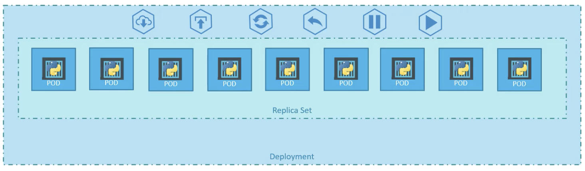
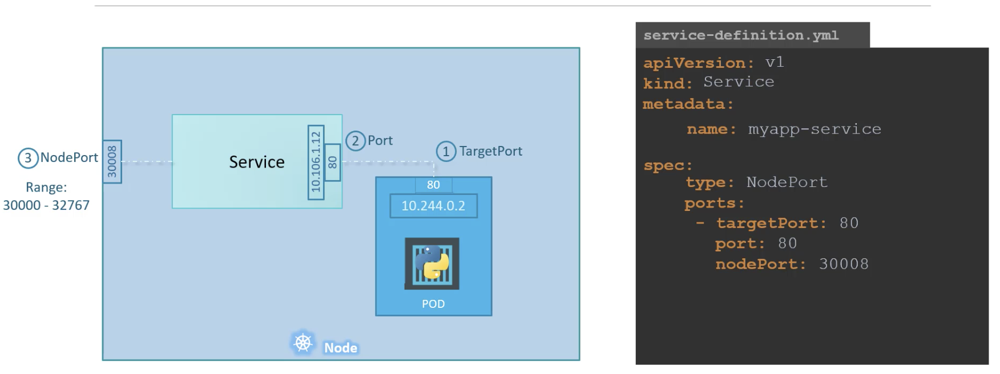

# Kubernetes (k8s)
### Refresh on Containers
Containers:
- provide isolated environments
  - Dependency management nightmares become troubled sleep
- are light-weight since they use the host's OS kernel
- are amazing

### Orchestration
- Coordinating between containerized applications (e.g. database and your application)
- Scaling your containerized application
- All done with declarative configuration files (e.g. YAML)
- Docker Swarm is easy to setup but less configurable

# Architecture


## Components
[https://kubernetes.io/docs/concepts/overview/components/](https://kubernetes.io/docs/concepts/overview/components/)
### Control Plane
- API Server: Exposes the Kubernetes API
- etcd: A distributed key-value store
- controller: Monitors and enforces: pod replication, node uptime, service accounts, and tokens
- scheduler: Watches for newly created, nodeless pods and selects a node
### Node Components
- kubelet: An agent that ensures that containers are running on the node
- container runtime: The runtime for the containers (e.g. Docker)
- kube-proxy: maintains network rules on nodes that allow network communication to your Pods from network sessions inside or outside of your cluster.

# Resource Types

## Pod
A pod is the atomic unit of a k8s application.  Pods typically consist of a single container although they can also have multiple containers.  A pod can thus be thought of as a subnet (a pod of whales), where its constituent containers share an IP address, volumes, a network port range, and localhost (so intra-pod communication is via local host).

```yaml
apiVersion: v1
kind: Pod
metadata:
  name: myapp-pod
  labels:
      app: myapp
      type: front-end
spec:
  containers:
    - name: nginx-controller
      image: nginx
```

In addition to application containers, pods can contain *init containers* that run during Pod startup or *ephemeral* that can be injected for debugging.
## Replica Set
A Replica Set monitors a collection of nodes, ensuring that *x* replications of a pod are up at any given point in time.

Replica sets have pod definitions embedded in their spec (under *template*).  They have the additional *replicas* property, which defines the size of the replica set, and *selector*, which defines which pods will be managed (based on the label).
```yaml
apiVersion: apps/v1
kind: ReplicaSet
metadata:
  name: myapp-replicaset
  labels:
      app: myapp
      type: front-end
spec:
  template:
    metadata:
      name: myapp-pod
      labels:
        app: myapp
        type: front-end
    spec:
      containers:
      - name: nginx-controller
        image: nginx

  replicas: 3
  selector:
    matchLabels:
      type: front-end
```
## Deployment
A deployment is to a replica set what a replica set is to a pod.  It is useful for allowing rolling updates when your system or application needs to be updated with no interruption in application availability.

Rolling updates are supported by the deployment process, which will duplicate replica sets and create a new (updated) pod in that set before spinning down a pod in the old replica set.  A similar strategy is used to rollback changes.  The configuration file for a deployment is nearly identical to that of a replica set.

`kubectl rollout status|history|undo <deployment resource name>`

## Service (connectivity)
A service is a network abstraction over a set of pods, allowing inter-cluster communication.

Since pods are assigned IP addresses but live inside of a node, one cannot directly address pods from outside of the node.  While one could ssh into the node to occasionally debug the issue, k8s provides services for interacting with pods/applications from a point that is external to nodes.

### NodePort
A service that employs port-forwarding; it listens on a port on the node and forwards traffic to a port in the pod.  A NodePort forwards traffic to the pods that match its *selector* clause, automatically spanning multiple nodes if the pods are distributed.


### ClusterIP
Creates a virtual IP inside the cluster to enable communication between different application clusters.  In other words, the virtual IP serves as a proxy for clusters, allowing other clusters to use that single proxy IP to interact with a service (e.g. a database) without knowing anything about the pods that underly that service.

# Configuration files
All k8s configuration is done via YAML files.  At a minimum, each k8s config file must contain the following (4) properties:
```yaml
apiVersion: <v1,app/v1>
kind: <resource-type>
metadata: <dict with labels, name, ...>
spec: <information on resource instantiation>
```

# Quickstart
I used minikube to run a single node cluster for playing around: `brew install minikube`.

```
minikube start
minikube stop
```

## Cheatsheet
### kubectl
https://kubernetes.io/docs/reference/kubectl/overview/

```
kubectl apply -f <filename>
kubectl get all|pods|events|nodes|replicasets|deployments|...
kubectl describe <resource-type> <resource-name>
kubectl config view
```

# Sources
- https://kubernetes.io/docs/home/
- Udemy: Kubernetes for the Absolute Beginners - Hands-on