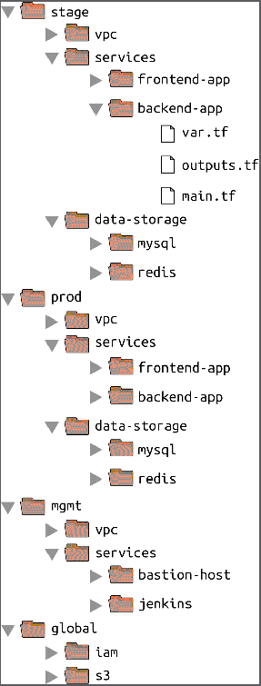

# Terraform
- [Terraform](#terraform)
  - [Overview](#overview)
  - [Basic workflow](#basic-workflow)
    - [Init](#init)
    - [Destroy](#destroy)
  - [Syntax](#syntax)
      - [Provider](#provider)
      - [Resource](#resource)
      - [Resource attribute reference](#resource-attribute-reference)
  - [Variables](#variables)
    - [Input variables](#input-variables)
    - [Setting input variables](#setting-input-variables)
    - [Referencing input variables](#referencing-input-variables)
      - [EOF](#eof)
  - [Progressive Example](#progressive-example)
    - [Create a basic EC2 instance](#create-a-basic-ec2-instance)
    - [Name the instance](#name-the-instance)
    - [Deploy a webserver to the instance](#deploy-a-webserver-to-the-instance)
- [Terraform state management](#terraform-state-management)
  - [State isolation](#state-isolation)
  - [Terraform_remote_state Data Source](#terraform_remote_state-data-source)
- [Modules](#modules)
  - [Module Definition](#module-definition)
  - [Module Usage](#module-usage)
  - [References](#references)
## Overview

<dl>
  <dt>Immutable</dt>
  <dd>Terraform reduces configuration drift by treating deployments as atomic entities.  Modifying the version of one tool results in an entirely new deployment</dd>
  <dt>Declarative</dt>
  <dd>All you do is declare the end state that you want, and Terraform figures out how to get to that end state, Terraform will also be aware of any state it created in the past.</dd>
  <dt>Agentless</dt>
  <dd>No agent/client needs to be installed on servers in order to interface with Terraform commands</dd>
</dl>

## Basic workflow
```shell
terraform init    # run once for the project
terraform plan    # see staged changes
terraform apply   # apply change set
```

### Init
The terraform binary contains the basic functionality for Terraform, but it does not come with the code for any of the providers (e.g., the AWS provider, Azure provider, GCP provider, etc.), so when you’re first starting to use Terraform, you need to run `terraform init` to tell Terraform to scan the code, figure out which providers you’re using, and download the code for them. By default, the provider code will be downloaded into a .terraform folder, which is Terraform’s scratch directory (you may want to add it to .gitignore). [(Brikman, p 78)](#Brickman) <br>
The init command is idempotent, so it’s safe to run it multiple times to ensure that things are configured.
### Destroy
`terraform destroy` can be used to remove all resources.  This is intended for use in a sandbox environment and should never be run in a production.

## Syntax
#### Provider
```shell
provider "aws" {
  region = "us-east-2"
}
```

#### Resource
```shell
resource "<PROVIDER>_<TYPE>" "<NAME>" {
  [CONFIG ...]
}
```

where PROVIDER is the name of a provider (e.g., aws), TYPE is the type of resource to create in that provider (e.g., instance), NAME is an identifier you can use throughout the Terraform code to refer to this resource (e.g., my_instance), and CONFIG consists of one or more arguments that are specific to that resource.

#### Resource attribute reference
```shell
<PROVIDER>_<TYPE>.<NAME>.<ATTRIBUTE>  # e.g. aws_security_group.instance.id
```

## Variables
### Input variables
```
variable "my_var_name" {
  description = "An example of a number variable in Terraform"
  type        = number
  default     = 42
}
```
### Setting input variables
If you omit the default variable, Terraform will interactively prompt you to enter a value for the field when you run `terraform apply`.
[(Brikman, p 109)](#Brickman)

You can also provide a value using the `-var` command line option or by adding a *TF_VAR_varname* environment variable.

```
terraform plan -var "server_port=8080"
export TF_VAR_server_port=8080
```
### Referencing input variables
`var.<VARIABLE_NAME>`

To use a reference inside of a string literal, you need to use a new type of expression called an interpolation, which has the following syntax:
`"${...}"`

#### EOF
The <<-EOF and EOF are Terraform’s heredoc syntax, which allows you to create multiline strings without having to insert newline characters all over the place.

## Progressive Example
### Create a basic EC2 instance
```shell
provider "aws" {
  region = "us-east-2"
}

resource "aws_instance" "example" {
  ami           = "ami-0c55b159cbfafe1f0"
  instance_type = "t2.micro"
}
```

### Name the instance
```shell
provider "aws" {
  region = "us-east-2"
}

resource "aws_instance" "example" {
  ami           = "ami-0c55b159cbfafe1f0"
  instance_type = "t2.micro"

  tags = {
    Name = "terraform-example"
  }
}
```

### Deploy a webserver to the instance
Since we are using a dummy webserver, we can use the User Data configuration that is available in EC2 instances to pass in a script.
```
provider "aws" {
  region = "us-east-2"
}

resource "aws_instance" "example" {
  ami           = "ami-0c55b159cbfafe1f0"
  instance_type = "t2.micro"

  user_data = <<-EOF
              #!/bin/bash
              echo "Hello, World" > index.html
              nohup busybox httpd -f -p 8080 &
              EOF

  tags = {
    Name = "terraform-example"
  }
}
```

Additionally, we must configure the network traffic access settings for our webserver.

```
resource "aws_security_group" "instance" {
  name = "terraform-example-instance"

  ingress {
    from_port   = 8080
    to_port     = 8080
    protocol    = "tcp"
    cidr_blocks = ["0.0.0.0/0"]
  }
}
```

Once the security group has been created, you need to configure your EC2 instance to actually use it.  Resources typically _export_ attributes and the security group resource specifically exports an _id_.  We can configure the EC2 instance to use this resource group by setting the vpc_security_group_ids to the security group's id:

```
resource "aws_instance" "example" {
  ami           = "ami-0c55b159cbfafe1f0"
  instance_type = "t2.micro"
  vpc_security_group_ids = [aws_security_group.instance.id]
  ...
```
[(Brikman, p 101)](#Brickman)


# Terraform state management
Every time you run Terraform, it records information about what infrastructure it created in a Terraform state file. By default, when you run Terraform in the folder /foo/bar, Terraform creates the file /foo/bar/terraform.tfstate. This file contains a custom JSON format that records a mapping from the Terraform resources in your configuration files to the representation of those resources in the real world.  Using version control for maintaining state is not recommended because of the need for locking, storing plaintext secrets, and manual errors with commits.  Instead of using version control, the best way to manage shared storage for state files is to use Terraform’s built-in support for remote backends. A Terraform backend determines how Terraform loads and stores state. The default backend, which you’ve been using this entire time, is the local backend, which stores the state file on your local disk. [(Brikman, p 137)](#Brickman)

## State isolation
The author recommends using separate Terraform folders (and therefore separate state files) for each environment (staging, production, etc.) and for each component (VPC, services, databases). [(Brikman, p 165)](#Brickman)



Within each component, there are the actual Terraform configuration files, which are organized according to the following naming conventions:
<dl>
  <dt>variables.tf</dt>
  <dd>Input variables</dd>
  <dt>outputs.tf</dt>
  <dd>Output variables</dd>
  <dt>main.tf</dt>
  <dd>The resources</dd>
</dl>

When you run Terraform, it simply looks for files in the current directory with the .tf extension, so you can use whatever filenames you want.

## Terraform_remote_state Data Source
See [(Brikman, p 173)](#Brickman) for how to use cloud secret managers.

# Modules
A Terraform module allows developers to encapsulate configuration in the same way that a function allows developers to encapsulate statements. A module is any set of Terraform configuration files in a folder.  Since terraform will load configurations from across .tf files, it doesn't matter if a module is 1 file or 10.

## Module Definition


## Module Usage
To import a module, you can use the following syntax:

```
module "my_module_name" {
  source = "../relative/path/to/the/module/folder”

  [CONFIGS]...
}
```

Wi

## References
<a id="Brikman">[1]</a> 
Terraform: Up and Running, Second Edition by Yevgeniy Brikman (O’Reilly). Copyright 2019 Yevgeniy Brikman, 978-1-492-04690-5.