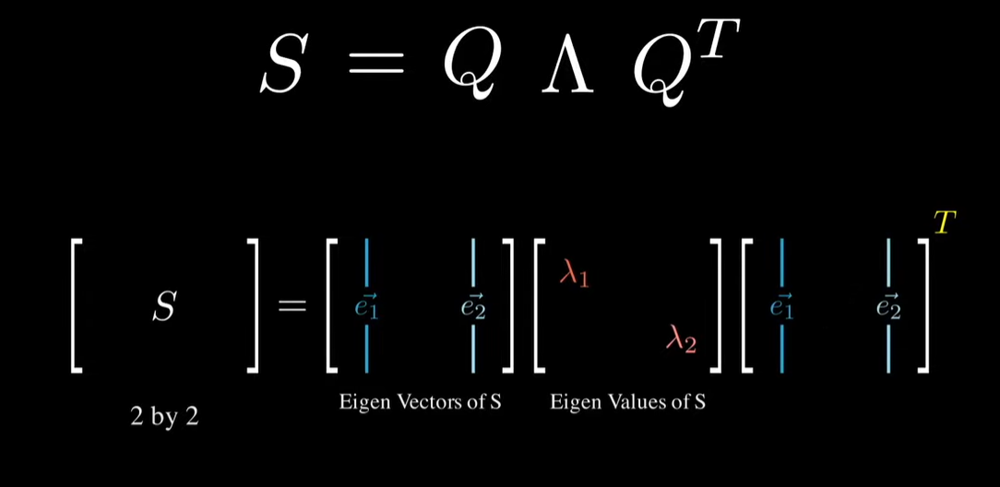

## Linear combinations, spans and basis vectors
Linear transformations are matrix transformations that, in two-dimensional space, leave the origin unchanged and do not bend lines.

Span as the set of all points that can be represented as the linear combination of a group of basis vectors.  2 vectors in 2d space span 2d space if they are linearly independent, otherwise their span is a single line.  In 3d space, 2 LI vectors span a plane and 3 span 3d space.

Think of a linear transformation of a span  You can describe it in terms of an operation that you could perform on any vector in the span in order to transform it to its new coordinate.  ...pull from video...

For a transformation in 2D space, we can define a **transformation as the set of vectors that our basis unit vectors are mapped to in the transformation**, such that the $i^{th}$ column of the transformation (matrix) represents the new coordinate for $i^{th}$ unit basis ($i^{th}$ unit basis is all zeros with a 1 in the $i^{th}$ location, 1-indexed).

So the matrix
$$\begin{bmatrix}
    2  & -1 \\
    1  & 0 \\
\end{bmatrix}$$
can be interpreted as rotating and stretching the unit vector $i=\begin{bmatrix}1 \\0 \end{bmatrix} \rightarrow \begin{bmatrix}2 \\1 \end{bmatrix}$ and the unit vector $j=\begin{bmatrix}0 \\1 \end{bmatrix} \rightarrow \begin{bmatrix}-1 \\0 \end{bmatrix}$.

## Determinant
Can think of things as ways to SCALE our unit vectors

The determinant of a  transformation (matrix) can be thought of as the magnitude of the change in any given area in the span represented by a transformation.  So a determinant of 2 implies that the area of any region in the space is doubled after the transformation is applied.  The determinant of a 3D matrix represents scaling of the volume of an area.

## Rank, inverses, and null spaces
Rank = Number of dimensions in the output of a transformation

Column space - set of all possible output of $A\vec{v}$

If $Rank(A) < Dim(A)$, then many vectors are mapped to the origin point by transformation $A$.  Otherwise, only 1 vector, the origin itself, is.

The null space, or kernel, of a transformation is the set of all vectors that are mapped to the origin by a transformation

The inverse of a matrix transformation is equivalent to reversing the transformation.

## Dot and Cross Products
The **dot product** is a symmetric projection of one vector onto another.

The **cross product** in 2d space is area of parallelogram formed by 2 vectors (and their shifted clones).  So if you remember that the determinant of a matrix (transformation) is the magnitude of the increase in area, then the calculation of the cross product of two vectors becomes obvious, it is the determinant of the matrix created from those vectors, since that matrix represents shifts to the unit basis vectors (which have area/volume of 1).  Negative determinant means a change in orientation

## Change of basis
A^(-1)MA is indicative of a change of basis, or changing coordinate spaces.  A represents the change of basis transformation, and M is the transformation represented in the local coordinate system.

## Eigenvectors and Values
$A\vec{x}=\lambda\vec{x}$ .  From this equation, we understand that the eigenvectors of a transformation are the vectors in the original space that occupy the same span in the new space (i.e. the transformation only stretches them by some constant, $\lambda$, value.)

The eigenvector of a 3d transformation gives you an axis of rotation for the transformation.

Eigenvectors of a symmetric matrix are orthogonal to each other.

## Spectral Decompositions

Note that this formula looks like a change of basis formula from above, and it is in fact one.  It rotates the orthogonal eigenvectors (A is symmetric) to the origin, stretches the compenents in proportion to the eigenvalues, and then rotates the thing back to the original coordinate space.

## Single Vector Decomposition
$A=U \Sigma V^T$

Essentially, any complicated transformation can be represented as the matrix product of 3 simple transformations:

$A=U \Sigma V^T$

where U and V are orthogonal matrices ($X^T = X^{-1}$ , describing rotations) and $\Sigma$ is a diagonal rectangular matrix representing a stretch.  This is simply spectral decomposition generalized, since we note that $XX^T$ is always symmetric, so spectral decomposition works for this.

### PCA
PCA can be implemented in one of two ways:

- A spectral decomposition of the covariance or correlation matrix
- A singular value decomposition (SVD) of the data matrix, X

Note that PCA grabs the orthogonal eigenvectors of the correlation matrix, which is useful for assessing linear seperability, while SVD looks at the data values themselves and is probably useful for visualization.

# Resources
[Essence of Linear Algebra Youtube series](https://youtu.be/fNk_zzaMoSs?si=MhvkfNweyoKm6NHe)