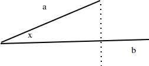
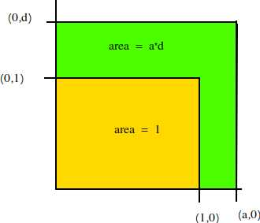

# Linear Algebra (Refresher)

Linear algebra is the study of vectors and vector spaces.  The term linear is used to describe the case where every variable has a degree of at most 1 and its coefficient is a numeric value.  For instance, $y=mx+b$ is a linear equation but $y=mx^2+b$ and $y=zx+b$ are not, since the variable $x$ has a degree greater than 1 and a variable coefficient, respectively.

## Vectors

A vector is a list of numbers, i.e. $[1, 2, 4, 6]$ , that have specific operations defined for them.  The simplest of these operations are defined as components level operations such as:

 - Addition : $[1,2] + [5,8] = [(1 + 5), (2 + 8)] = [6,10]$
 - Multiplication by a scalar : $ 3 * [1,2] = [3,6]$
 
We can also think of a vector as the sum of the scalar multiples of unit vector components.  In most cases, these unit vector components are the natural basis, $e_1=[1,0,0,...0], e_3=[0,0,1,0,0,...,0]$.  We can therefore describe a vector as the sum of scalar multiples of these basis vectors.  For example, the vector $[1,3]$ can also be written as $3e_1 + 2e_2$.

### Dot Product

$$ [1,2] \bullet [5,8] = 1(5) + 2(8) = 21$$

The dot (or inner) product of 2 vectors, defined as sum of the products of the corresponding components in each vector, has some very useful properties.  Let us look at some of these:

A vector 'dotted' with itself is equal to the vectors magnitude squared - $a \bullet a = |a|^2$

##### The angle between vectors

Most usefully, we can recall the cosine rule : $c^2 = a^2 + b^2 - 2ab\cos\theta$, which tells us the relationship between 2 vectors, a and b, the angle between them, $\theta$, and the third side of the triangle, c, that would be formed by connecting a and b.  We can rewrite this, in terms of our new dot product operator, as 
$$|a-b|^2 = |a|^2 + |b|^2 - 2|a||b|\cos\theta$$

and we rewrite the left side as

$$ = |a-b|\bullet|a-b| = a \bullet a - a \bullet b - a \bullet b + b \bullet b$$
$$ = |a|^2 - 2(a \bullet b) + |b|^2$$

Plugging this back into our first equation and cancelling out terms yields:

$$a \bullet b = |a||b|\cos\theta$$

__So the dot product can be used to determine the alignment of 2 vectors__!

If two vectors are pointed in the same direction (one is a positive scalar multiple of another), then $\cos0 = 0$ and therefore the dot product of the two vectors is 0.  Likewise, if the vectors are orthogonal then $\cos90 = 1$ and $a \bullet b = |a||b|$.

#### Projections

The projection of vector $a$ onto vector $b$ can be visualized with the following picture.

where the projection is the magnitude of the vector that starts at the origin of $b$ and ends at the dotted line. Since we have a right triangle, we can determine the projection $\rho$ as 

$$ \cos\theta = \frac{adj}{hyp} = \rho /|a|$$

$$\frac{a \bullet b}{|a||b|} = \frac{\rho}{|a|}$$

$$ \rho = \frac{a \bullet b}{|b|} $$

Another important idea is that of a vector projection, which is simply the scalar projection multiplied by the unit vector of b ($\frac{b}{|b|}$).  So the vector projection of a onto b is given by:

$$ = \frac{a \bullet b}{|b|} * \frac{b}{|b|}$$ 

As motivation for the next section, we can see that if we were to take the vector projection of $a$ onto $b$ then we have $c$ such that $a$ can be represented in component form as $... + cb$. So we can write $ cb = \frac{a \bullet b}{|b|} * \frac{b}{|b|}$ and therefore

$$ c = \frac{cb}{b} = \frac{1}{b} * \frac{a \bullet b}{|b|} * \frac{b}{|b|} = \frac{a \bullet b}{|b|^2}$$

#### Basis vectors

As hinted at above, we can represent a vector in terms of a new set of basis vectors.  If the basis vectors are orthogonal to each other, then we can use the dot product to do this.  The vector $r$ can be represented in terms of orthogonal basis vectors $a$ and $b$ simply by using the unit projection of $r$ onto each basis vector as the associated component coefficient.  Formally, $r$ represented in these terms as (using results from above):

$$ [\frac{r \bullet a}{a \bullet a} , \frac{r \bullet b}{b \bullet b}]$$

### Basis

A _basis_ is a set of $n$ vectors that are linearly independent (1 vector cannot be represented as a linear combination of some set of the other vectors) and span the entire vector space (any vector in the space can be represented as a linear combination of the _basis_ vectors).  If these hold, then the vector space of that basis is said to be $n$ dimensional.

## Matrices

A matrix is a 2 dimensional vector of real (?) numbers which represent the coefficients in a system of simultaneous equations.  For instance,

$$ 3x + 2y = 12$$
$$ 4x + 8y = 18$$

can be represented in matrix notation as: 

$$\left[ {\begin{array}{cc}
   3 & 2\\
   4 & 8\\
  \end{array} } \right] \left[ {\begin{array}{c}
   x\\
   y\\
  \end{array} } \right] =  \left[ {\begin{array}{c}
   12\\
   18\\
  \end{array} } \right]$$
  
To think about what a matrix represents, from a geometric perspective, lets look at what happens when we multiply the standard basis' by a matrix

$$\left[ {\begin{array}{cc}
   a & b\\
   c & d\\
  \end{array} } \right] \left[ {\begin{array}{c}
   1\\
   0\\
  \end{array} } \right] = \left[ {\begin{array}{c}
   a\\
   c\\
  \end{array} } \right] \quad , \quad \left[ {\begin{array}{cc}
   a & b\\
   c & d\\
  \end{array} } \right] \left[ {\begin{array}{c}
   0\\
   1\\
  \end{array} } \right] = \left[ {\begin{array}{c}
   b\\
   d\\
  \end{array} } \right]$$
  
We see that the ith column of the matrix tells us what happens to the unit vector along the ith axis of our space. This is an interesting feature as we see that it makes it pretty easy to understand how to rotate our space in a predictable manner.  For instance, say we have a picture that we want to rotate by 90 degrees, counter clockwise.  We can achieve this by applying a single matrix transformation to each vector (column) of pixels in the picture.  What is the matrix transformation?  Well, we want the x-axis unit vector $[1,0]$ transformed to $[0,1]$ (a 90 degree rotation) and the y-axis transformed to $[-1,0]$ (a 90 degree rotation).  Thus, the transformation matrix that represents a 90 degree counter clockwise rotation is the matrix composed of these transformed axis vectors, 

$$\left[ {\begin{array}{cc}
   0 & -1\\
   1 & 0\\
  \end{array} } \right]$$
  

_So we can also say that a matrix is a transformation of vector space and that the columns of a transformation matrix are the axes of the new basis vectors of the transformed space!_

#### Quick notes on solving simulataneous equations with matrices

To solve a particular system of simultaneous equations, reduce the system to row echelon form.  To solve the system for all r such that $Av = r$, we can find the inverse of matrix $A$, $A^{-1}$ and multiply both sides by it: 

$$ A^{-1}(Av) = A^{-1}r = v$$

### Determinants

The determinant of a matrix is the scale/factor by which a matrix transformation changes the size of a vector space.  For instance, the determinant of the matrix

$$\left[ {\begin{array}{cc}
   a & 0\\
   0 & d\\
  \end{array} } \right]$$

is $a*d$ since this tranformation increases the size of our vector space by a factor of $a*d$ (see picture below).

In the general case of a matrix 
$$\left[ {\begin{array}{cc}
   a & b\\
   c & d\\
  \end{array} } \right]$$

the determinant can be shown (draw out the resulting parallelogram and compute its area as the area of the surrounding box minus the areas of the triangles and squares outside of the parallelogram) to be: 

$$determinant = ad - cb$$

We note that the determinant can be used to derive the identity matrix and also to determine the linear independence of the rows of a matrix transformation (a determinant of 0 means that there is a linear dependence and that the matrix is therefore _singular_ ).

#### Orthogonal Matrices

An orthogonal matrix is a matrix that consists of pairwise orthogonal columns.  It is orthonormal if each column is a unit vector (length of 1).  For an orthonormal matrix, $A^T=A^{-1}$ and the determinant of the A is $\pm1$.

## Key Points

 - The columns of a matrix transformation represent the new basis vectors for the transformed space
 - The determinant of a matrix is the scaling of the transformation, in terms of the size of the transformed space
 - Assume that we want to apply some sort of transformation, which is easily representable in the basis space X, to a basis space Y in which the transformation easy to intuit(vector space).  If we know the transformation (matrix) A such that AX = Y, then we can get the desired transformation in Y by transforming the transformation represented in X basis form using matrix A. (or something like that)

# Essentials of Linear Algebra
## Linear combinations, spans and basis vectors
Linear transformations are matrix transformations that, in two-dimensional space, leave the origin unchanged and do not bend lines.

Span as the set of all points that can be represented as the linear combination of a group of basis vectors.  2 vectors in 2d space span 2d space if they are linearly independent, otherwise their span is a single line.  In 3d space, 2 LI vectors span a plane and 3 span 3d space.

Think of a linear transformation of a span  You can describe it in terms of an operation that you could perform on any vector in the span in order to transform it to its new coordinate.  ...pull from video...

For a transformation in 2D space, we can define a **transformation as the set of vectors that our basis unit vectors are mapped to in the transformation**, such that the $i^{th}$ column of the transformation (matrix) represents the new coordinate for $i^{th}$ unit basis ($i^{th}$ unit basis is all zeros with a 1 in the $i^{th}$ location, 1-indexed).

So the matrix
$$\begin{bmatrix}
    2  & -1 \\
    1  & 0 \\
\end{bmatrix}$$
can be interpreted as rotating and stretching the unit vector $i=\begin{bmatrix}1 \\0 \end{bmatrix} \rightarrow \begin{bmatrix}2 \\1 \end{bmatrix}$ and the unit vector $j=\begin{bmatrix}0 \\1 \end{bmatrix} \rightarrow \begin{bmatrix}-1 \\0 \end{bmatrix}$.

## Determinant
Can think of things as ways to SCALE our unit vectors

The determinant of a  transformation (matrix) can be thought of as the magnitude of the change in any given area in the span represented by a transformation.  So a determinant of 2 implies that the area of any region in the space is doubled after the transformation is applied.  The determinant of a 3D matrix represents scaling of the volume of an area.

## Rank, inverses, and null spaces
Rank = Number of dimensions in the output of a transformation

Column space - set of all possible output of $A\vec{v}$

If $Rank(A) < Dim(A)$, then many vectors are mapped to the origin point by transformation $A$.  Otherwise, only 1 vector, the origin itself, is.

The null space, or kernel, of a transformation is the set of all vectors that are mapped to the origin by a transformation

The inverse of a matrix transformation is equivalent to reversing the transformation.

## Dot and Cross Products
The **dot product** is a symmetric projection of one vector onto another.

The **cross product** in 2d space is area of parallelogram formed by 2 vectors (and their shifted clones).  So if you remember that the determinant of a matrix (transformation) is the magnitude of the increase in area, then the calculation of the cross product of two vectors becomes obvious, it is the determinant of the matrix created from those vectors, since that matrix represents shifts to the unit basis vectors (which have area/volume of 1).  Negative determinant means a change in orientation

## Change of basis
A^(-1)MA is indicative of a change of basis, or changing coordinate spaces.  A represents the change of basis transformation, and M is the transformation represented in the local coordinate system.

## Eigenvectors and Values
$A\vec{x}=\lambda\vec{x}$ .  From this equation, we understand that the eigenvectors of a transformation are the vectors in the original space that occupy the same span in the new space (i.e. the transformation only stretches them by some constant, $\lambda$, value.)

The eigenvector of a 3d transformation gives you an axis of rotation for the transformation.

Eigenvectors of a symmetric matrix are orthogonal to each other.

## Spectral Decompositions

Note that this formula looks like a change of basis formula from above, and it is in fact one.  It rotates the orthogonal eigenvectors (A is symmetric) to the origin, stretches the compenents in proportion to the eigenvalues, and then rotates the thing back to the original coordinate space.

## Single Vector Decomposition
$A=U \Sigma V^T$

Essentially, any complicated transformation can be represented as the matrix product of 3 simple transformations:

$A=U \Sigma V^T$

where U and V are orthogonal matrices ($X^T = X^{-1}$ , describing rotations) and $\Sigma$ is a diagonal rectangular matrix representing a stretch.  This is simply spectral decomposition generalized, since we note that $XX^T$ is always symmetric, so spectral decomposition works for this.

### PCA
PCA can be implemented in one of two ways:

- A spectral decomposition of the covariance or correlation matrix
- A singular value decomposition (SVD) of the data matrix, X

Note that PCA grabs the orthogonal eigenvectors of the correlation matrix, which is useful for assessing linear seperability, while SVD looks at the data values themselves and is probably useful for visualization.

# Resources
[Essence of Linear Algebra Youtube series](https://youtu.be/fNk_zzaMoSs?si=MhvkfNweyoKm6NHe)