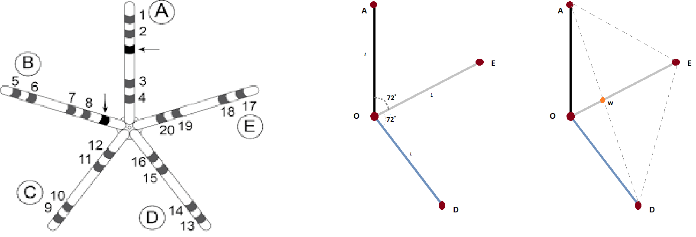

# Geometrical Shapes on a polymetric surface
## Background
The pentaray catheter forms a pentagon, with 5 equally spaced and equally sized spines occupying a single plane in 3D space.  During an operation, a doctor will move this catheter along the surface of the heart and record the signal readings at each electrode on the catheter (points 1-20).  Our user does not have direct access to the catheter location, so we must watch what the physician is doing on another screen and attempt to mirror the placement of the catheter on our own model of the heart.
## Problem Definition
With as few clicks as possible, allow a user to record the position and orientation of a pentaray catheter relative to a 3d mesh of a heart.  I believe that I can do this with 3 points.  The first should represent the location of the catheter's center, *O*, and the other two should be the locations of adjacent spine tips (*A* and *E*).  Given these 3 points, I should be able to derive the location of the other 3 spine tips (*D*, *C*, and *B*) and subsequently the location of the electrodes along each spine.

## Attempt 1 - System of simulateneous linear equations
I initially tried to solve this with a set of simultaneous linear equations, but I failed to come up with a 3rd independent equations to constrain the points.  My constraints were:
1. $w_0 + w_1x+w_2y+w_3z = 0$. All of the other points were on plane that was normal to the 3 points O,A, and E. So use one of the well known methods for deriving that plane given 3 points on the plane.
2. $\frac{\vec{OA} \cdot \vec{OE}}{|\vec{OA}||\vec{OE}|}=\cos{72^o}$ . Since this was a pentagon, all angles between sides would be equal (so 360/5) and I could use the dot product formulation
3. :(

## Attempt 2 - Vector arithmetic and geometry
I started drawing lines between points to figure out which vectors I had and if I could use vector arithmetic to derive new points.  When I drew the lines connecting A to E and E to D, it hit me that D was a simple projection of point A over the line $\vec{OE}$.  More concretely, $\vec{OD} = \vec{Ow} + \vec{Aw}$.  One could calculate $w$ as the projection of vector $\vec{OA}$ onto $\vec{OE}$, so I could use the dot product to get the magnitude of that projection, scale the unit vector of $\vec{OE}$ according to that magnitude, and then adding the point $\dot{O}$ (since the above would give me a vector representing a movement in space but the starting point was $\dot{O}$ and not the origin [0,0,0]).

$w = (\frac{\vec{OA} \cdot \vec{OE}}{|\vec{OE}|}\times\vec{OE}) + \dot{O}$