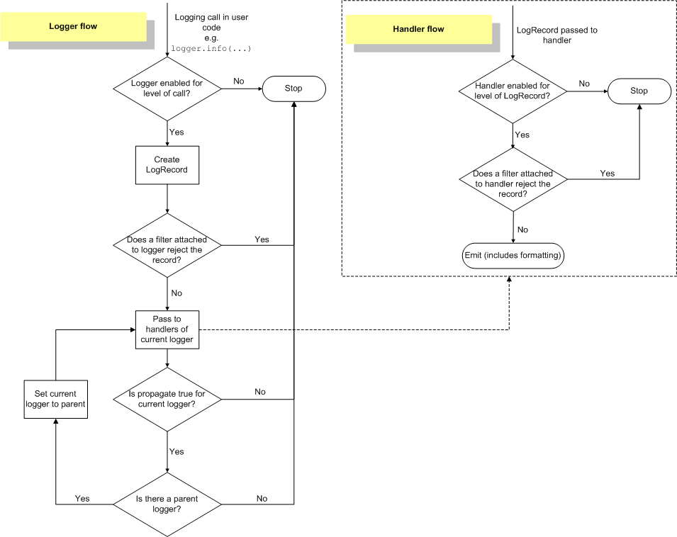

# Logging
[Offical Documentation](https://docs.python.org/3/howto/logging.html)

The logging library takes a modular approach and offers several categories of components: loggers, handlers, filters, and formatters.  It is easiest to envision this setup in terms of a unilateral message publishing system

<dl>
  <dt>Loggers</dt>
  <dd>Log message producer</dd>
  <dt>Handlers</dt>
  <dd>Subscribers to log messages, redirects messages to output systems/streams</dd>
  <dt>Filters</dt>
  <dd>Finer grained (e.g. regex) control over which logs get published</dd>
  <dt>Formatters</dt>
  <dd>Specify the layout of log messages</dd>
</dl>



## Loggers
Logger objects have a threefold job:
1. Expose methods to application code for runtime logging
2. Determine which log messages to act upon based upon severity or filter objects
3. Pass along relevant log messages to all interested log handlers

The most widely used methods on logger objects fall into two categories:
1. Configuration
   1. set severity level, add/remove Handler, add/remove Filter and message sending.
2. Publish
   1. debug, info, warning, error, critical

| Level    | Usage                                                    |
| -------- | -------------------------------------------------------- |
| DEBUG    | Detailed, diagnostic information                         |
| INFO     | Feedback about normal functioning of system              |
| WARNING  | Avoidable issue arose, but processing was NOT terminated |
| ERROR    | Error encountered and the process cannot proceed         |
| CRITICAL | The program itself may be unable to continue running     |
---
### Logger ancestry
getLogger() returns a reference to a logger instance with the specified name if it is provided, or root if not. The names are period-separated hierarchical structures (e.g. `foo.bar`, `foo.bar.baz`, and `foo.bam` are all descendants of `foo`)

If a level is not explicitly set on a logger, the level of its parent is used instead as its effective level.

Child loggers propagate messages up to the handlers associated with their ancestor loggers (set the propagate attribute of a logger to False to prevent this)

## Handlers
Handler objects are responsible for dispatching the appropriate log messages to the handler’s specified destination, with each logger object being able to register 0+ handlers.

The standard library includes quite a few handler types, so configuration of handlers is often limited to setting the severity level, adding a formatter, and adding/removing filters.

Application code should not directly instantiate and use instances of Handler.

## Configuration
[Official Docs](https://docs.python.org/3/library/logging.config.html#module-logging.config)

### Example
#### logging_configs.yaml
```yaml
version: 1
formatters:
  basic:
    format: '%(asctime)s - %(name)s - %(levelname)s - %(message)s'
    datefmt: "%H:%M:%S"
  json: 
    format: "%(asctime)s %(name)s %(levelname)s %(message)s"
    datefmt: "%Y-%m-%dT%H:%M:%SZ"
    class: "pythonjsonlogger.jsonlogger.JsonFormatter"
handlers:
  console:
    class: logging.StreamHandler
    formatter: basic
    level   : WARN   # Only log WARN severity or higher to console
  file:
    class: logging.handlers.TimedRotatingFileHandler
    when: W0
    interval: 7
    backupCount: 1
    formatter: json   # write json entries for easier automated log parsing tool consumption
    filename: "logs/app.log"
loggers:
  prima.ui.heart_tagging.ui_model:  # configure logger associated with a module
    level: DEBUG  # within this module, log at DEBUG level
    handlers: [console]
root:  # configure root logger
  level: INFO   # default to INFO level logging
  handlers: [console, file]  # register a console and file log handler
```
#### utils.py
```python
from logging.config import dictConfig
import yaml

def configure_logging() -> None:
    with open("logging_configs.yaml", "r") as fp:
        dictConfig(yaml.safe_load(fp))
```
#### app.py
```python
# START - Can be done in utils or logs module
from logging.config import dictConfig
import yaml

def configure_logging() -> None:
    with open("logging_configs.yaml", "r") as fp:
        dictConfig(yaml.safe_load(fp))

# END - Can be done in utils or logs module

configure_logging()
log = logging.getLogger(__name__)
...
log.info("Loading App")
```

#### Results
##### Console
```
Dash is running on http://127.0.0.1:8051/

 * Serving Flask app 'heart_tagging_ui'
 * Debug mode: on
2023-09-11 12:07:56,298 - __main__ - WARNING - Warn
2023-09-11 12:07:56,563 - prima.ui.heart_tagging.ui_model - WARNING - Warn
2023-09-11 12:07:56,563 - prima.ui.heart_tagging.ui_model - WARNING - Warn
```

##### app.log
```
2023-09-11 12:07:52,397 - dash.dash - INFO - Dash is running on http://127.0.0.1:8051/

2023-09-11 12:07:55,358 - __main__ - INFO - Loading App
2023-09-11 12:07:56,297 - __main__ - INFO - Info
2023-09-11 12:07:56,298 - __main__ - WARNING - Warn
2023-09-11 12:07:56,553 - prima.ui.heart_tagging.ui_model - DEBUG - Debug
2023-09-11 12:07:56,563 - prima.ui.heart_tagging.ui_model - INFO - Info
2023-09-11 12:07:56,563 - prima.ui.heart_tagging.ui_model - WARNING - Warn
```

## Resources
- [Best Practices](https://betterstack.com/community/guides/logging/python/python-logging-best-practices/)
- [Configuration Format](https://docs.python.org/3/library/logging.config.html#module-logging.config)
- [Offical Logging Documentation](https://docs.python.org/3/howto/logging.html)