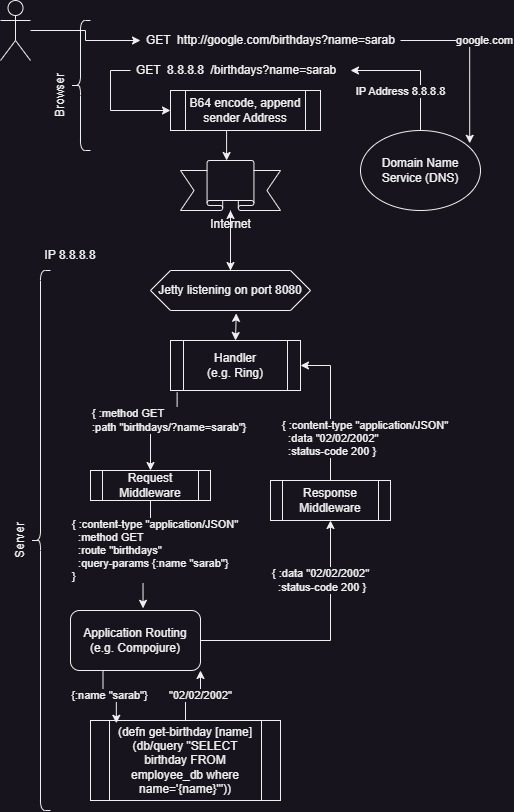

- [HTTP](#http)
  - [URI](#uri)
  - [Methods](#methods)
  - [Status codes](#status-codes)
  - [HTTP Request components](#http-request-components)
  - [HTTP Response components](#http-response-components)
- [REST](#rest)
  - [API Best Practices](#api-best-practices)
  - [Alternatives](#alternatives)
- [Handles, Routes, and Middleware](#handles-routes-and-middleware)
  - [Ring](#ring)
  - [Compojure](#compojure)

## HTTP
### URI
\<protocol\>://\<service-name\>/\<resource-path\>

### Methods
- GET: This is used for fetching details from the server and is basically a read-only operation.
- POST: This method is used to **create** new resources on the server.  Has a payload (data)
- PUT: This method is used to **update or replace** the existing resources on the server
- DELETE: This method is used to delete the resource on the server.
- PATCH: This is used for modifying the resource on the server.
- OPTIONS: This fetches the list of supported options of resources present on the server.
- HEAD: Basically GET but requests the headers ONLY


GET, HEAD, OPTIONS are safe and idempotent methods, PUT and DELETE methods are only idempotent, and POST and PATCH methods are neither.

### Status codes
- 1xx - represents informational responses
- 2xx - represents successful responses
- 3xx - represents redirects
- 4xx - represents client errors
- 5xx - represents server errors

#### Common codes
- 200 - success/OK
- 201 - CREATED - used in POST or PUT methods.
- 304 - NOT MODIFIED - used in conditional GET requests to reduce the bandwidth use of the network
- 400 - BAD REQUEST - This can be due to validation errors or missing input data.
- 401 - UNAUTHORIZED - No valid authentication credentials sent along with the request.
- 403 - FORBIDDEN - sent when the user does not have access (or is forbidden) to the resource.
- 404 - NOT FOUND - Resource method is not available.
- 500 - INTERNAL SERVER ERROR - server threw some exceptions while running the method.
- 502 - BAD GATEWAY - Server was not able to get the response from another upstream server.

### HTTP Request components
- Method : i.e. GET, PUT, POST, DELETE, etc
- URI : Uniquely identifies the resources on the server
- HTTP Version : Version of HTTP protocol you are using (e.g. HTTP v1.1)
- Request Header : Details of the request metadata such as client type, the content format supported, message format, cache settings, etc.
- Request Body: The actual message content to be sent to the server.

### HTTP Response components
- Response Status Code : Server response status code
- HTTP Version: The HTTP protocol version
- Response Header: Metadata of the response message. Data can describe what is the content length, content type, response date, what is server type, etc.
- Response Body: The actual resource/message returned from the server.

## REST
- REST stands for Representational State Transfer
- Uses client/server model, where client state is NOT stored on the server
  - It is NOT possible to maintain sessions unless the client-side manages a session id
- Uses HTTP for implementation
  - request headers, request body, response body, status codes
- Lightweight, provide maintainability, scalability, support communication among multiple applications that are developed using different programming languages
- They provide means of accessing resources present at server required for the client via the web browser
- Data transfer format is typically JSON or XML, but also supports MIME and Text
- REST does not impose security restrictions inherently. It inherits the security measures of the protocols implementing it.

### API Best Practices
- Accept and respond with JSON data format whenever possible (since javascript will likely parse it)
  - response and request headers should have Content-Type set to as application/JSON
- Naming
  - Use lowercase, underscores, and plural nouns and not verbs (HTTP method is the verb). An appropriate 
- Return a standard HTTP status code that best expresses the return status (e.g. Not Found vs Forbidden)
- Include filtering and pagination for large resources.
- Secure your endpoints
  - Use HTTPS
  - Use SSL (certificates are easier to get/use) and load on the server
  - Incorporate authorization with roles/services
- Version your API, typically with /vX at the beginning of the API path
  - When the URI is updated, the older URI must be redirected to the new one using the HTTP status code 300.


### Alternatives
- SOAP - Bloat but can be used for enhanced security and reliability
- Web Sockets - establish connection and then maintain a stateful session (needed for streaming)

:::::::::::::::::::::::::::::::::::::::::::::
HERE
:::::::::::::::::::::::::::::::::::::::::
https://www.youtube.com/watch?v=U6OAdQqWegQ


# Client Server Data Flow


Interacting directly with HTTP responses/requests is very complicated at a low level, but at a higher level of abstraction it is fairly simple.  We use a Web Server tool (e.g. Tomcat, Flask, Jetty) to handle the hard stuff and provide our application with a simpler interface.
To simplify either further, so that our application deals with as little boilerplate as possible, we use programming language specific libraries (e.g. Spring, Ring) for handling, routing, and processing requests/responses in language specific data structures.  I will use the Clojure web service stack to demonstrate.

## Handles, Routes, and Middleware
The [Ring](https://github.com/ring-clojure/ring/wiki/Concepts) library is Clojure's standard framework for defining *handlers* and *middleware* for web services.

### Handlers
Handlers are functions that define your web application. Synchronous handlers take one argument, a map representing a HTTP *request*, and return a map representing the HTTP *response*.

```clojure
(defn what-is-my-ip [request]
  {:status 200
   :headers {"Content-Type" "text/plain"}
   :body (:remote-addr request)})
```

#### Requests
While middleware can and often does add custom, application specific keys, each Ring request will also have the following set of standard keys:
```clojure
:server-port The port on which the request is being handled.
:server-name The resolved server name, or the server IP address.
:remote-addr The IP address of the client or the last proxy
:uri The request URI (the full path after the domain name).
:query-string The query string, if present.
:scheme The transport protocol, either :http or :https.
:request-method The HTTP request method, which is one of :get, :head, :options, :put, :post, or :delete.
:headers hashmap (lowercase header name) of headers metadata.
:body An InputStream for the request body, if present.
```
#### Responses
```clojure
:status The HTTP status code, such as 200, 302, 404 etc.
:headers hashmap of header metadata
:body  A string, Iseq, File, InputStream
```

### Middleware
Middleware are higher-level functions that add additional functionality to handlers. The first argument of a middleware function should be a *handler*, and its return value should be a new *handler function* that will call the original *handler*.

Here is a simple example that adds a content-type attribute to a *response*.

```clojure
(defn wrap-content-type [handler content-type]
  (fn [request]
    (let [response (handler request)]
      (assoc-in response [:headers "Content-Type"] content-type))))


(def app
  (-> handler
      (wrap-content-type "text/html")
      (wrap-keyword-params)
      (wrap-params)))
```

### Compojure
[Compojure Wiki](https://github.com/weavejester/compojure/wiki)

Lightweight package for defining routes, using Ring handlers as the data structure.
```clojure
(def my-routes
  (routes
   (GET "/foo" [] "Hello Foo")
   (GET "/bar" [] "Hello Bar")))

(defroutes user-routes
  (context "/user/current" []  ; define routes that share a common prefix
    (GET "/" [] ...) ; the route that exists at "/user/current"
    (GET "/profile" [] ...)
    (GET "/posts" [] ...)))
```
