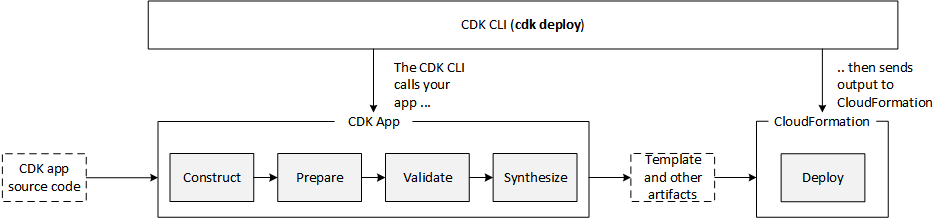

# CDK
https://docs.aws.amazon.com/cdk/latest/guide/home.html

# Core Concepts
https://docs.aws.amazon.com/cdk/latest/guide/core_concepts.html

## Constructs
Constructs are the basic building blocks of AWS CDK apps.  A construct can represent a single resource (e.g. an S3 bucket) or a composition of resources.

>The key pattern for defining higher-level abstractions through constructs is called composition. A high-level construct can be composed from any number of lower-level constructs, and in turn, those could be composed from even lower-level constructs. To enable this pattern, constructs are always defined within the scope of another construct. This scoping pattern results in a hierarchy of constructs known as a construct tree. In the AWS CDK, the root of the tree represents your entire AWS CDK app. Within the app, you typically define one or more stacks, which are the unit of deployment, analogous to AWS CloudFormation stacks. Within stacks, you define resources, or other constructs that eventually contain resources.

#### Initialization
All constructs extend the Construct base class and are instantiated with 3 parameters: <br>
- *scope* - the object's parent in the construct tree
- *id* - unique id within the current *scope*
- *props* - A map of properties (key/value pairs).

#### Constructs within an **App**
An entire CDK application is called an **App**.  An application is a bundle of resources that is associated with a particular environment (e.g. region and account).  This bundle is known as a **Stack**.  Below is an example app file, where a new Stack class is created (extending Stack).  The base Stack constructor is invoked and then additional resources are allocated within the stack.  A new s3 bucket is created with custom property values, here with versioning and static website hosting enabled.  Read access to the bucket is then granted to the *data-science* iam group.

```
import { App, Stack, StackProps } from '@aws-cdk/core';
import * as s3 from '@aws-cdk/aws-s3';

class HelloCdkStack extends Stack {
  constructor(scope: App, id: string, props?: StackProps) {
    super(scope, id, props);

    const rawData = new s3.Bucket(this, 'raw-data', {
        websiteIndexDocument: 'index.html',
        versioned: true
    });

    const dataSciGroup = new iam.Group(this, 'data-science');
    rawData.grantRead(dataSciGroup);

  }
}

const app = new App();
new HelloCdkStack(app, "HelloCdkStack");

```

### AWS construct library
A collection of constructs representing AWS resources.  The 3 basic levels are described below and the following link can be used to look up available constructs:

https://docs.aws.amazon.com/cdk/api/latest/docs/aws-construct-library.html


#### CFN resources
Pass through implementations of CloudFormation resources.  One must explicitly configure all resource properties when constructing these.

#### Intent-based API
Build on top of the CFN resources but handle many of the details, boilerplate, and glue logic.  They provide reasonable default values as well as convenience functions for higher level tasks.

#### Patterns
Larger constructs that implement common tasks in AWS, which often require multiple resources.  For example, one might consist of provisioning an S3 public bucket for a website along with storage and a load balancer.

## App
An app is the root of your construct tree.  Once can use the `cdk synth` command to compile the cdk code into a series of CloudFormation templates (typically one for each Stack), although this is typically just done automatically during `cdk deploy`.


*App lifecycle : https://docs.aws.amazon.com/cdk/latest/guide/apps.html*

## Stack
https://docs.aws.amazon.com/cdk/latest/guide/stacks.html

A stack is the unit of deployment in the AWS CDK.  All AWS resources are defined within the scope of a stack are provisioned as a single unit.  A single cdk app could have multiple stacks.  As practical example of this is defining stacks for different app layers (e.g. database, ui, monitoring) and for multiple environments (e.g. test, staging, production).  Here is some example code for that (from the link listed above):

```
import { App, Construct, Stack } from "@aws-cdk/core";

interface EnvProps {
  prod: boolean;
}

// imagine these stacks declare a bunch of related resources
class ControlPlane extends Stack {}
class DataPlane extends Stack {}
class Monitoring extends Stack {}

class MyService extends Construct {

  constructor(scope: Construct, id: string, props?: EnvProps) {
  
    super(scope, id);
  
    // we might use the prod argument to change how the service is configured
    new ControlPlane(this, "cp");
    new DataPlane(this, "data");
    new Monitoring(this, "mon");  }
}

const app = new App();
new MyService(app, "beta");
new MyService(app, "prod", { prod: true });

app.synth();
```

Use the `cdk ls` command to list all Stacks for an App.

## Assets
https://docs.aws.amazon.com/cdk/latest/guide/assets.html
This is probably going to be important in the future (an asset is the ultimate functionality that this infrastructure is meant to support) so I am including it here.

## Minor Concepts
### Environments

When using cdk deploy to deploy environment-agnostic stacks, the AWS CDK CLI uses the specified AWS CLI profile (or the default profile, if none is specified) to determine where to deploy. The AWS CDK CLI follows a protocol similar to the AWS CLI to determine which AWS credentials to use when performing operations against your AWS account.

### Tokens
Tokens are CDK placeholders for values that won't get resolved until later in the app's lifecycle (e.g. S3 bucket name is assigned by CloudFormation during deployment).  You can reference tokens in your App or Stacks and it will be resolved automatically in the appropriate lifecycle stage.  If your software application needs access to a token, you can export the token as an environment variable and the value will be placed in the environment after resolution.

```
const bucket = new s3.Bucket(this, 'MyBucket');

const fn = new lambda.Function(stack, 'MyLambda', {
  // ...
  environment: {
    BUCKET_NAME: bucket.bucketName,
  }
});
```

### Parameters
>In general, we recommend against using AWS CloudFormation parameters with the AWS CDK. Parameter values are not available at synthesis time and thus cannot be easily used in other parts of your AWS CDK app, particularly for control flow.
<br>...<br>
It is better, again in general, to have your CDK app accept any necessary information from the user and use it directly to declare constructs in your CDK app

### Tagging
Use the Tag construct to add tags to a component.  The snippet below associated *a-value* with *my-key*, with an assignment priority of 300 (in case *my-key* is associated with another value).
```
Tag.add(myConstruct, 'my-key', 'a-value', {
  priority: 300
});
```

#### Note
Much of this material is taken sourced from the official aws documentation and no claims of originality are made on it.  Credit belongs to the Amazon AWS team.
https://docs.aws.amazon.com/cdk/latest/guide/home.html
