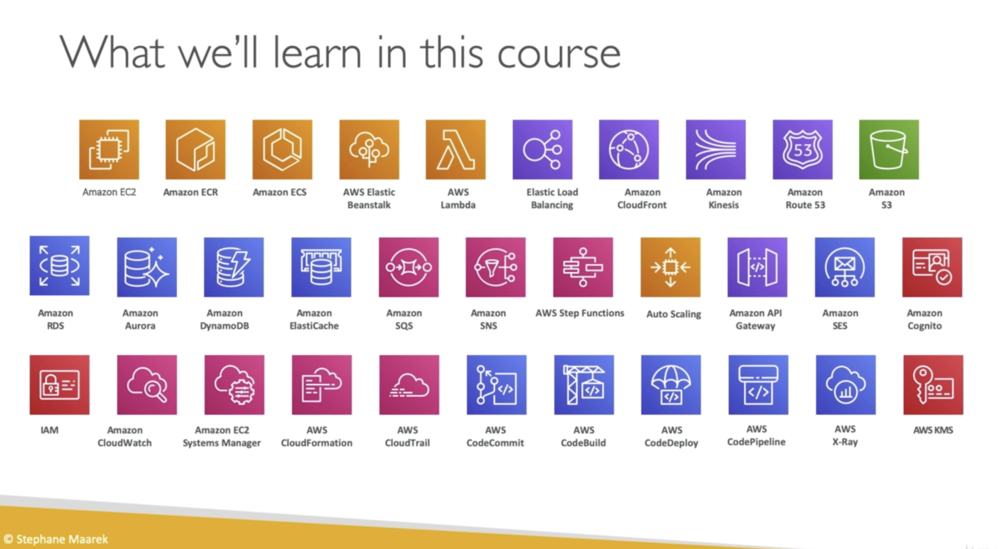

# Overview

*AWS services that will be covered*

## Regions and availability zones
Regions are geographical areas that contain groups of availability zones, usually $2 \leq x \lt 6$.  An availability zone is a single data-center.  All availability zones in a region are geographically distinct but connected with low latency, high bandwidth network infrastructure.  A region name is typically of the form *ap-us-ohio-2*, which has the availability zone (2) embedded in the region name.

Many AWS services are regional services but some, including IAM, are global.

## IAM (Identity Access Management)