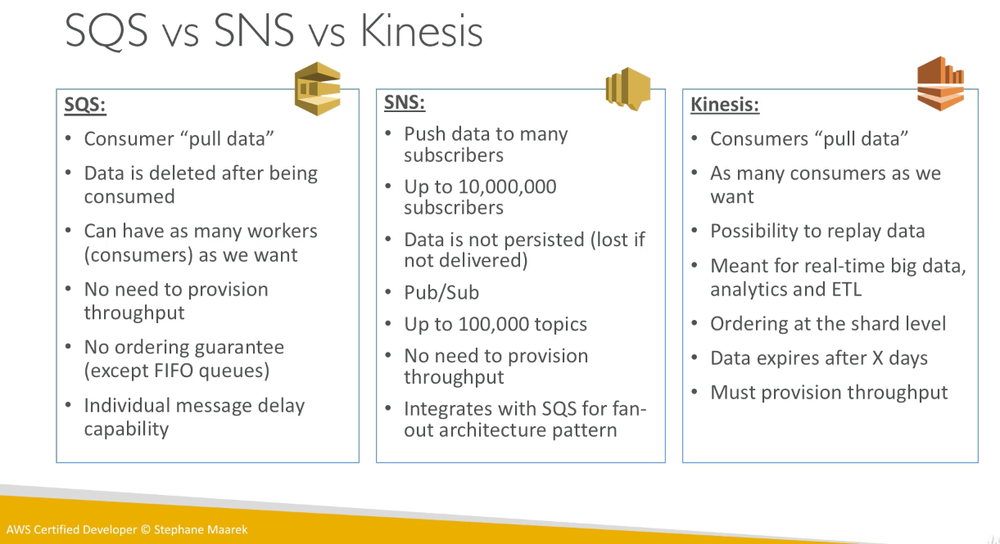

# Relational Datastores and ElastiCache
## RDS
RDS stands for Relational Database Service.  It is a managed service on which you can run relational databases such as Postgres and MySQL.
It has the following advantages over just running a containerized DB instance in EC2:
- Automated patching and provisioning
- Continuous backup allowing for Point in Time restoration
- Monitoring dashboards
- Read replicas
- Multiple availability zones, maintenance windows, horizontal and vertical scaling, storage backup (EBS)

## Aurora
Aurora is an AWS-optimized Relational Database that implements the same protocols as (and is therefore compatible with the drivers of) MySql and PostGres.  It comes in a standard version (very similar to other RDS databases), a serverless version (no capacity planning), and a global version (auto allocation across availability zones).

## ElastiCache
ElastiCache is a managed cache service that implemented either the Redis or Memcached cluster engine.  In other words, it is an in-memory database that is used for storing a copy of frequently accessed data, relieving the load on the DB while also increasing your application's response times.
<!--  -->

# Queues and Messages
AWS offers a Simple Queue Service (SQS) for queues, Simple Notification Service (SNS) for the publish and subscribe pattern, and Kinesis for streaming.

<!--  -->

Note that Redis offers data durability and can be used as a conventional database, whereas Memcached can only serve as a cache.

### Security
#### Encryption
In-flight, at-rest, and client-side encryption are all supported.
#### Access
- IAM policies to regulate access to the SQS API
- SQS access policy similar to the S3 bucket policies
  - Useful for cross-account access to the queues

## SQS
- Unlimited throughput and message capacity
- Limited retention, 1 minute < X < 14 days
- Limited message size of 256 KB
- At least once delivery
- Best Effort ordering
- Delayed processing (per queue or per message)

When a message is polled from a consumer, it becomes invisible for 30 seconds to ensure that the consumer can process the data.  If the consumer does not delete the message (or make an API call to increase the invisibility window duration) by the end of the invisibility window then the message will become visible and another consumer will process the message.  If this happens often enough (configurable) for a message, that message will go to the Dead Letter Queue.  This allows logic and workflows to be built around the frequently failing jobs/message.

## SNS
SNS is a managed notification system for the Publish / Subscribe model.  An SNS instance contains many topics.  An event producer (e.g. publisher) writes a single message to a topic while all subscribers to that topic receive that message.  Subscribers can be SQS, HTTP/HTTPS, Lambda, Emails, SMS messages, and Mobile Notifications.  A common pattern is combining SNS and SQS to write to multiple queues from a single service (fan out).

## Kinesis
Kinesis handles real-time big data such as application logs, IoT, and clickstreams.

## Amazon MQ
AWS provides Amazon MQ, a managed message broker service for Apache ActiveMQ, to assist with migrating on-premise (queue utilizing) architectures to the cloud.