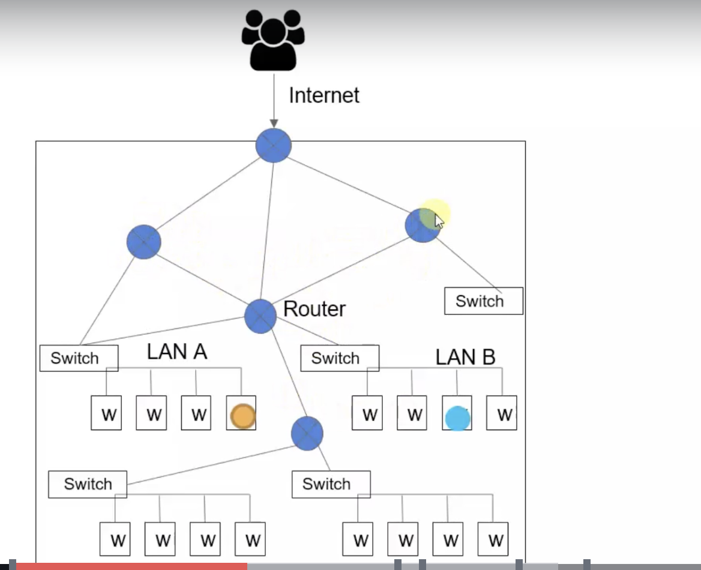
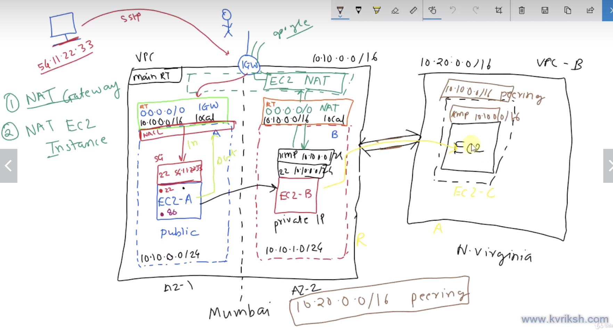

# Network overview

*https://docs.aws.amazon.com/cdk/latest/guide/apps.html*

## Traditional IT systems
For computers that are connected via a LAN network, MAC addresses are  used to address computers.  **Switches** are the technology that handle address resolution.
### Cloud equivalent
A LAN connected network is digitally mirrored as a *subnet*.  Within a subnet, services can communicate with each other fairly easily.

## Traditional IT system
For trans-LAN connected networks, **Routers** are used to address individual machines.  This is typically done at the IP layer (so host files are used).  Companies typically deploy a few routers for internal purposes and then use another router to add a layer on top of that.

### Cloud equivalent
A multi-cluster network is digitally mirrored as a Virtual Private Cloud (VPC).  There is a router within that VPC that facilitates egress/ingress and communication between services.

## VPC components overview
- CIDR - Classless InterDomain Routing - Used for addressing within your VPC.
- VPC gives you a private address range
- Subnets are used to partition the address range of your VPC
- Route table define the traffic flow (egress and ingress)
- Internet GateWay (IGW) is the proxy between your VPC and the internet
- Virtual Private Gateway allows for VPN and Direct Connect access to your VPC

### CIDR
A CIDR address is a 4 byte string of the form X.X.X.X/P, each X represents a byte and P (the prefix) represents how many of the first P bits are used to designate the host (so the remaining bits are available for addressing within your host).

Subnets are typically created with a prefix of 24, leaving one with 255 addresses that are available within a host.

### Route Tables
Every VPC has a main Route Table (RT), which all subnets use if they do not have subnet-specific RT.  Each RT has an entry for the local host and this ensures intra-subnet communication.  To access the internet, an Internet GateWay instance must exist and a route table entry for 0.0.0.0/0 (0 prefix implies no host, so that gets routed to IGW)

### Security Groups
A Security group is the first level of network security.  It is a whitelist of rules (e.g. rule_name, port, IP_range) for inbound and outbound traffic.  For instance, to allow ssh access to your service you might create a inbound rule in your security group that opens port 22 for a specific IP address (your dev machine). By default, all outbound routes are allowed.

Security Groups only support whitelisting; you cannot explicitly block access on a port:IP range pair using security groups

### Network Access Control Link (NACL)
NACLs are the second level of network security.  NACLs are another set of rules but these rules can be ALLOW or DENY rules and priority (e.g. evaluation order) can be assigned.

### Network Address Translation (NAT)
Internet requests from private networks are routed through a Network Address Translation system, which associates its own IP to requests so that the private network's IPs are not exposed.

## Inter-VPC communication

### VPC Endpoint
A VPC endpoint can be setup to allow communication between a VPC and some AWS resources (e.g. an S3 bucket or DynamoDB table) that are colocated in the same region.  This connection is private and isn't internet-based so it is more secure and does not incur network costs.

### VPC Peering
Two VPCs can be connected (one VPC is the Requesting VPC and the other is an Accepting VPC) with a VPC Peering connection.

### VPN and Direct Connect
VPNs and Direct Connects are two means of connecting on premise resources with AWS resources.  A VPN is an encrypted, internet-based connection between the resources.  A Direct Connect is NOT internet-based and therefore requires a private physically wired connection between the data center and the on prem resources.

*Illustrative Diagram of the above terms*