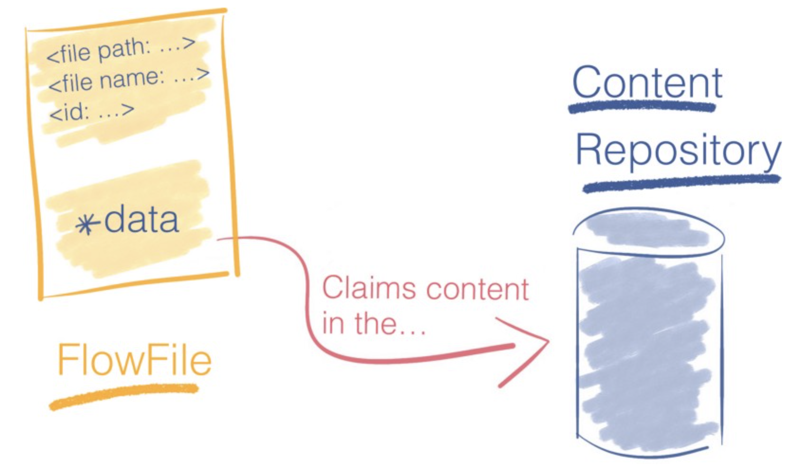

# Markdown Basics

##  Emphasis

The *stated* mission: To go __boldly__ where _no one_ has **gone** before. Unfortunately, there are some issues at the bleeding edge, like when you need emphasize single characters __b__ c __d__ ... in these cases, use a soft hyphen and all will be well ... __b&#173;__ c __d&#173;__.

### Color

You can color your text with any of the following colors, `blue|red|green|pink|yellow`, and markdown:

I am red and proud

## New lines
Text will be rendered on a new line if your markdown line ends with two spaces.  
Alternatively, you can use the _br_ html syntax 
to achieve this goal.

Use three asterisks for a horizontal line
***

## To indent or not to indent 

> Of course, sometimes you will want to indent everything so as to create a block of text.
Do not fear, that is easy to do as well
>

## Lists

Let me list what I like about lists

* I like that you can use bullets
    * and indent as needed with tabs
        * to get nested lists  

Your syntax for the __first__ list dictates the list type, the most convenient list type, - or asterisks, can be used after that:

1. In case you like numbers
    - but hate to increment them
- Hyphen lists work as well

## Tex (math) markdown

But what is life without the likes of $c^2 = a^2 + b^2 - 2ab\cos\theta$ and $$ X = \frac{a \bullet b}{|b|} * \frac{b}{|b|}$$ 

<!-- A longer derivation with equations lined up

$\begin{align}
 L(\vec{w} | X) & = P(Y | X;\vec{w}) \\
 & = \prod_{i=1}^{N} P(Y = y_i | x_i;\vec{w}) \\
 & = \prod_{i=1}^{N} g_{\vec{w}}(x_i)^{y_i}(1-g_{\vec{w}}(x_i))^{1-y_i}
\end{align}$ -->

A stepwise function:

$P(X=x) = \left.
  \begin{cases}
    \rho , & \text{x = success or 1 } \\
    1-\rho, & \text{x = failure or 0 }
  \end{cases}
  \right\}$

## Tables
| Type | Notes |
|-|-|
|df[val] | Select single column or sequence of columns; val can be boolean array, slice operator, bit mask DataFrame |
|df.loc[val] | select row or subset of row by _label_|
|df.loc[val1,val2] | select both rows and columns by _label_|
| df.iloc[idx] | select row or subset of rows based on integer position |

## Graphics

What is life without a homemade image of vector projection?  Note the hover hint.

### Simple inline

### Customize inline image

## Hyper links
### Internal links

Did you forget how to add text emphasis in Markdown?  If so, the [emphasis section](#emphasis-sec) is just one click away.  You can add internal links for any header/section using its name, and replacing spaces and special characters with hyphens.  Want to see [indenting markdown](#To-indent-or-not-to-indent) ?

### External links
__[Click here to venture to the Wikipedia page on cats.](https://en.wikipedia.org/wiki/Cat)__

# Markdown References

- 'Markdown for Jupyter notebooks cheatsheet', Inge Halilovic. Feb 7, 2017.  https://medium.com/ibm-data-science-experience/markdown-for-jupyter-notebooks-cheatsheet-386c05aeebed
- 'Markdown Cheatsheet', Adam Pritchard. May 29, 2017. https://github.com/adam-p/markdown-here/wiki/Markdown-Cheatsheet
- https://www.markdownguide.org/basic-syntax/