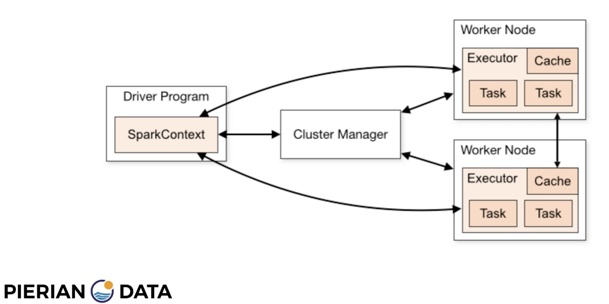

# Quickstart
`docker run -it --rm -p 8888:8888 -v $PWD:/home/jovyan/work --name spark jupyter/pyspark-notebook`

# Overview
### Big Data technologies
Hadoop, MapReduce, Spark, etc. are distributed technologies that allow users to store and run computations over datasets that are too large to fit into a computer's memory.  Hadoop is a combination (?) of the Hadoop File System (HDFS) and MapReduce, where HDFS is a distributed file store and MapReduce is a distributed computation framework.  Spark is an alternative distributed computation framework that can run over data in an HDFS instance but is also able to process data stored in AWS S3 buckets, Cassandra, and other data stores.

### Spark vs MapReduce
Spark can process data up to 100x faster than MapReduce.  It accomplishes this by keeping most of its data in memory (whereas MapReduce will write almost all data to disk) and only writing to disk when necessary.

### Spark Concepts
Spark runs on a Resilient Distributed Dataset (RDD), which is a dataset with four main features:
- Distributed
- Fault-tolerant
- Parallel
- Compatible with multiple data sources

Additionally, RDDs are immutable, lazily evaluated, and cacheable.

Spark has 2 types of operations:
- Transformation : An algorithm/recipe
- Action : The enactment of the transformation, with the result being 

#### Architecture

*Spark architecture*

# Cluster Managers
>Apache Spark, an engine for large data processing, can be run in distributed mode on a cluster. Spark applications are run as independent sets of processes on a cluster, all coordinated by a central coordinator. This central coordinator can connect with three different cluster managers, Spark’s Standalone, Apache Mesos, and Hadoop YARN (Yet Another Resource Negotiator).
>
>When running an application in distributed mode on a cluster, Spark uses a master/slave architecture and the central coordinator, also called the driver program, is the main process in your application, running the code that creates a SparkContext object. This driver process is responsible for converting a user application into smaller execution units called tasks. These tasks are then executed by executors which are worker processes that run the individual tasks.
>
>In a cluster, there is a master and any number of workers. The driver program, which can run in an independent process, or in a worker of the cluster, requests executors from the cluster manager. It then schedules the tasks composing the application on the executors obtained from the cluster manager.   The cluster manager is responsible for the scheduling and allocation of resources across the host machines forming the cluster. 
[source](#cluster_managers)

# Sources
1. https://clearwater.udemy.com/course/spark-and-python-for-big-data-with-pyspark/learn/lecture/6804314#overview
2. <a name="cluster_managers"> http://www.agildata.com/apache-spark-cluster-managers-yarn-mesos-or-standalone/ </a>